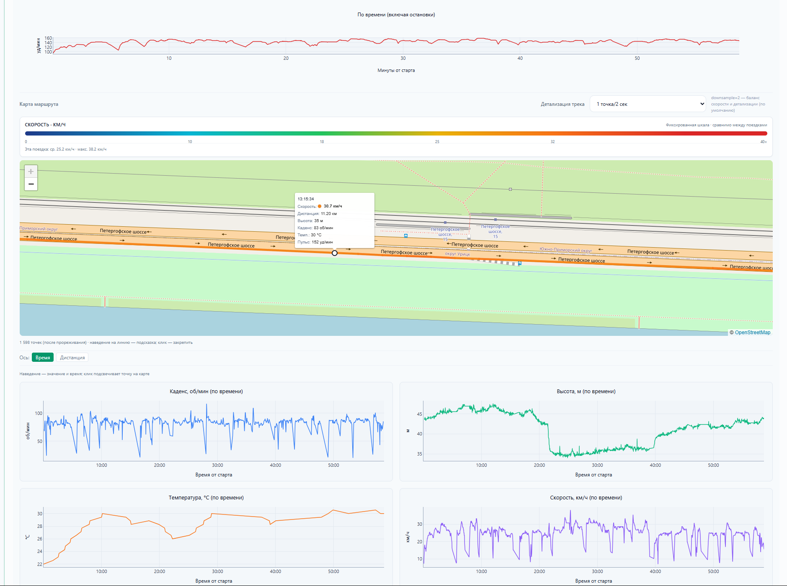
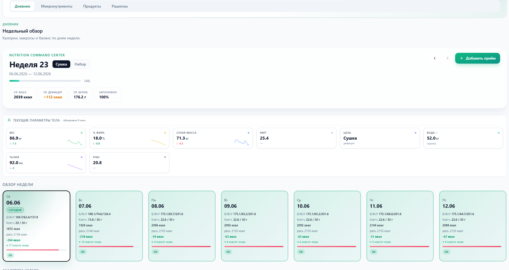
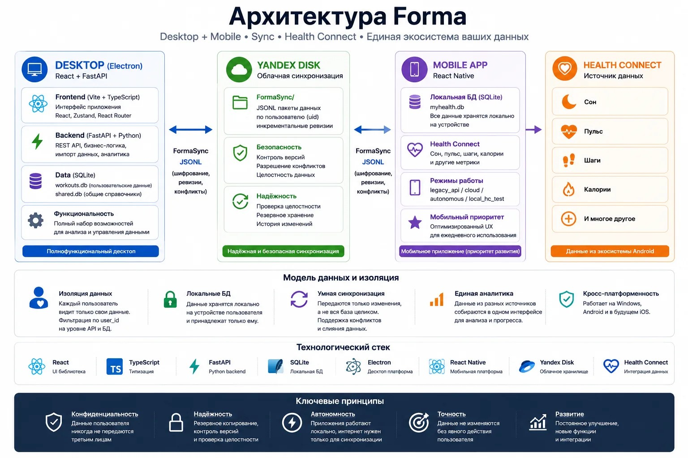

# Forma

Forma — личная фитнес-платформа для хранения, анализа и синхронизации данных о тренировках, питании и показателях тела.

Проект появился как попытка объединить более шести лет спортивных данных, которые постепенно расползлись по десяткам Excel-файлов. За 12 дней была создана первая рабочая версия: Electron desktop, FastAPI backend, React frontend, синхронизация через Яндекс.Диск, интеграция Polar и аналитика тренировок.

Forma появилась как попытка объединить более 6 лет спортивных данных, которые до этого хранились в тетрадях, заметках телефона и нескольких
десятках Excel-файлов.

## Download

Latest Windows installer:

https://github.com/brett263/Forma-public/releases/latest

## 🎥 Видеообзор

Полный обзор приложения и история разработки:

[Видеообзор](https://youtu.be/3-pLVAix0Ww)

В видео показаны:

- синхронизация с Polar;
- импорт FIT/GPX;
- дневник питания;
- аналитика тренировок;
- состав тела;
- восстановление;
- основные возможности Forma.

## За 12 дней была создана первая рабочая версия платформы:

- Electron desktop приложение
- FastAPI backend
- React frontend
- синхронизация через Яндекс.Диск
- интеграция Polar
- аналитика тренировок и восстановления

Проект разрабатывался одним человеком как личная система учёта тренировок.

## Возможности

- Журнал тренировок и история упражнений
- Импорт данных Polar, аналитика пульса
- Калькулятор калорий, история веса и параметров тела
- Синхронизация через Яндекс.Диск (FormaSync)
- Desktop + mobile (React Native Android) клиенты

## Технологии

React + TypeScript + Vite, Electron, FastAPI + Python, SQLite, React Native (Android), Health Connect, Yandex Disk.

Локальный health/fitness продукт с двумя клиентами:
- `desktop` (Electron + embedded FastAPI + `workouts.db`);
- `mobile` (React Native Android + локальная `myhealth.db`).

## Быстрый старт

| Сценарий | Команда | Результат |
|---|---|---|
| Dev web + API | `.\start.ps1` | UI на `:5173`, API на `:8000`/`:8002` |
| Desktop release | `cd frontend && npm run desktop:dist` | `frontend/release74/Forma Setup 0.74.0.exe` (runs `desktop:prepare-seed` + `desktop:check-secrets` before build) |
| Android release | `cd mobile && npm run android:release` | `mobile/android/.../app-release.apk` |

Полная установка для разработчиков: [`docs/DEVELOPER_SETUP.md`](docs/DEVELOPER_SETUP.md). Скопируйте [`.env.example`](.env.example) в `.env` — **не коммитьте** `.env`.

**Packaged desktop API:** default `http://127.0.0.1:8000/api/health`. Port is chosen from candidates `8000`–`8012` and stored in `%APPDATA%\Forma\forma-desktop-api.json`. Public OAuth template [`.env.desktop.public`](.env.desktop.public) uses port **8002** in example redirect URIs; Electron aligns Yandex/Google redirects on first run.

**OAuth (public install):** Google and Yandex use **PKCE** by default — only client IDs and redirect URIs are required in the installer. Polar needs a user-added `POLAR_CLIENT_SECRET` — see [`docs/POLAR_SETUP.md`](docs/POLAR_SETUP.md).

**Public schema baseline:** `SCHEMA_VERSION=80` (`v078` cardio duration/distance, `v079` meal-plan finalization, `v080` shared strength catalog). Current Dev code remains `SCHEMA_VERSION=79`; do not renumber either repo's existing migrations.

**Clean install seed:** packaged builds use `packaging/seed/*.db`, generated by `scripts/prepare_packaging_seed.py`; public GitHub `shared.db` must pass `scripts/audit_public_shared_db.py shared.db`.

## Текущее состояние (2026-06-09)

- **Desktop:** dashboard, settings, workouts/food/body hub, analytics, import/warmup, FormaSync, HC hub; mostly complete, stabilization phase.
- **Mobile:** active development priority; target is standalone daily app scope, not a thin companion.
- **Health Connect:** integration/validation phase for sleep, HR, steps, calories and sync ownership.
- **Sync:** FormaSync foundation exists; validation and conflict/source ownership checks are ongoing.
- **Open blockers:** body measurement edit crash (P0), exercise template block structure loss (P1).

Чеклист релиза: [`docs/RELEASE_READINESS.md`](docs/RELEASE_READINESS.md).

## Known limitations

- `legacy_api` mobile требует доступного ПК API.
- CTL/ATL/TSB — только cardio TRIMP.
- HC rollups sync лучше, чем raw HC records.
- FormaSync conflicts — pilot `food_entries`.

Детали: [`docs/KNOWN_ISSUES.md`](docs/KNOWN_ISSUES.md), [`docs/MOBILE.md`](docs/MOBILE.md), [`docs/ANALYTICS.md`](docs/ANALYTICS.md), [`docs/HEALTH_CONNECT.md`](docs/HEALTH_CONNECT.md).

## Карта документации

| Файл | Назначение |
|---|---|
| [`docs/DEVELOPER_SETUP.md`](docs/DEVELOPER_SETUP.md) | First-time setup |
| [`docs/PROJECT_CONTEXT.md`](docs/PROJECT_CONTEXT.md) | Desktop/mobile/HC/sync status |
| [`docs/ARCHITECTURE.md`](docs/ARCHITECTURE.md) | Architecture, sync, imports |
| [`docs/DATABASE.md`](docs/DATABASE.md) | Two-DB model, schema v80, v078/v079/v080, public shared policy |
| [`docs/PACKAGING_SECRETS.md`](docs/PACKAGING_SECRETS.md) | Public config vs secrets |
| [`docs/AUTH_PKCE_AUDIT.md`](docs/AUTH_PKCE_AUDIT.md) | Google/Yandex PKCE, redirect ports |
| [`DOCUMENTATION_SYNC_REPORT.md`](DOCUMENTATION_SYNC_REPORT.md) | Dev/Public documentation reconciliation report |
| [`docs/POLAR_SETUP.md`](docs/POLAR_SETUP.md) | Polar confidential client |
| [`CONTRIBUTING.md`](CONTRIBUTING.md) | Contributor workflow |
| [`SECURITY.md`](SECURITY.md) | Security model and reporting |
| [`LICENSE`](LICENSE) | MIT license |

Полный указатель: [`docs/README.md`](docs/README.md). Архив: [`docs/archive/`](docs/archive/).

## Public Repository Data Policy

| Artifact | In this repo? |
|----------|---------------|
| Root `shared.db` | **Yes** — sanitized reference catalog only (food, stretching, strength exercises, bike lookups) |
| `workouts.db` | **Never** — workouts, meal plans, body data, tokens, sync state |
| `.env` with secrets | **Never** — use `.env.example` / `.env.desktop.public` |

Сборка публичного `shared.db`: `python scripts/build_public_shared_db.py` → audit `python scripts/audit_public_shared_db.py shared.db`.  
Полная политика: [`docs/DATABASE.md`](docs/DATABASE.md#public-repository-data-policy).

## Статистика проекта

- 500+ силовых тренировок, 199 пробежек, 82 велотренировки, 28 плаваний (личный датасет автора)
- Schema v80; meal plans and rations live in `workouts.db` only (not shipped here)
- 40+ документов

## Почему проект открыт

Проект опубликован в образовательных целях: показать, что один человек без профессионального опыта в разработке может создать полноценное desktop-приложение с современными ИИ-инструментами.

## Как помочь проекту

Если Forma оказалась полезной, помочь проекту можно несколькими способами:

⭐ Поставить звезду на GitHub

Даже одна звезда помогает проекту стать заметнее и показывает, что приложение кому-то нужно.

🐞 Сообщать о проблемах

Если нашли баг или странное поведение — создайте Issue с описанием проблемы и шагами воспроизведения.

💡 Предлагать идеи

Новые идеи и предложения по развитию проекта приветствуются через Issues или Discussions.

☕ Поддержать разработку

Forma распространяется бесплатно и разрабатывается одним человеком в свободное время.

Если вы хотите поддержать дальнейшую разработку приложения, улучшение аналитики, синхронизации и мобильной версии, можете сделать добровольный донат.

[[Яндекс чаевые]](https://tips.yandex.ru/guest/payment/3893596)

[[DonationAlerts]](https://www.donationalerts.com/r/health_dashboard)

Поддержка не открывает дополнительные функции и не влияет на доступность приложения — это просто способ помочь развитию проекта.

Спасибо всем, кто пользуется Forma, тестирует новые версии и помогает делать приложение лучше ❤️

## Author

Forma is an independent open-source project created and maintained by IbhodI.

GitHub: @IbhodII

## License

This project is licensed under the MIT License.
See the LICENSE file for details.
