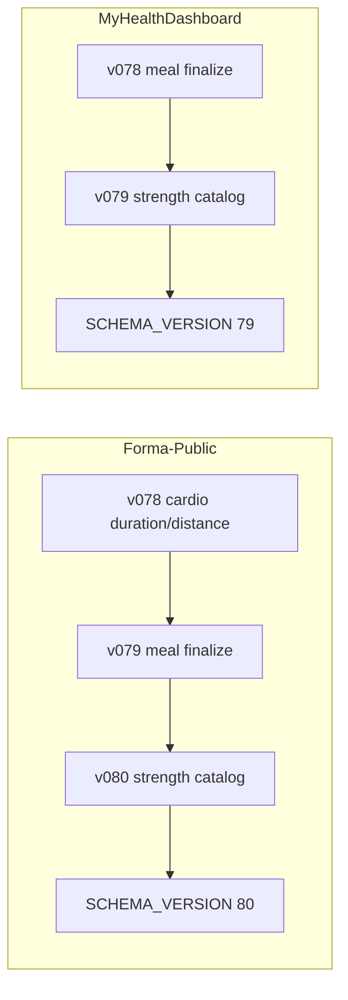

# Release Sync Report

**Date:** 2026-06-09 (post-synchronization cleanup)  
**Source (dev):** `C:\Projects\Forma\MyHealthDashboard`  
**GitHub-clean:** `C:\Projects\forma for git\Forma-Public`

---

## Executive summary

### Final recommendation: **SYNCED** (Forma-Public release readiness)

Forma-Public is **internally consistent** and **release-ready** after this synchronization pass:

- Documentation updated to **SCHEMA_VERSION 80** (matches `database/migrations.py`)
- `shared.db` rebuilt and passes `audit_public_shared_db.py` — **READY FOR GITHUB**
- Generated artifacts removed (`shared.db-wal`, `shared.db-shm`, `backend/logs/api.log`)
- Public-only release fixes preserved (packaging seed pipeline, Yandex `app_folder`, httpx, migration-based installer seed)
- `scripts/check_packaging_secrets.py` — **Packaging secret check OK**

### Dev ↔ public parity: **NOT SYNCED** (intentional, documented below)

MyHealthDashboard remains at `SCHEMA_VERSION=79` with a shorter migration chain. This is an expected divergence until Dev appends a reconciliation migration for Public's v078 cardio normalization. Existing Dev v078/v079 must not be renumbered.

---

## Synchronization actions completed (2026-06-09)

| Action | Result |
|--------|--------|
| Update public docs to SCHEMA_VERSION 80 | Done — `DATABASE.md`, `PROJECT_CONTEXT.md`, `KNOWN_ISSUES.md`, `NUTRITION.md`, `WORKOUTS.md`, `ARCHITECTURE.md`, `FORMA_SYNC.md`, `PACKAGING_SECRETS.md`, `RELEASE_READINESS.md`, `DOCUMENTATION_REFRESH_PLAN.md`, `docs/README.md` |
| Rebuild `shared.db` | Done — source: dev `shared.public.db` (audited sidecar); **not** dev `workouts.db` |
| Audit `shared.db` | **READY FOR GITHUB** (6 reference tables, no `openfoodfacts_cache`) |
| Remove `shared.db-wal` | Deleted |
| Remove `shared.db-shm` | Deleted |
| Remove `backend/logs/api.log` | Deleted (1.4 MB runtime log) |
| Preserve public-only fixes | No changes to packaging seed pipeline, Yandex scopes, httpx, migrations |
| Re-run packaging check | `check_packaging_secrets.py` OK |

### Rebuild command used

```powershell
python scripts/build_public_shared_db.py `
  --source "C:\Projects\Forma\MyHealthDashboard\shared.public.db" `
  --target "C:\Projects\forma for git\Forma-Public\shared.db"

python scripts/audit_public_shared_db.py shared.db
```

### `shared.db` after rebuild

| table | rows |
| --- | ---: |
| food_products | 21 |
| food_product_components | 0 |
| strength_exercises | 53 |
| stretching_exercises | 123 |
| tire_coefficients | 4 |
| surface_multipliers | 4 |

All 11 audit checks: **PASS**.

---

## Schema version (public — now consistent)

| Source | Version | Status |
|--------|---------|--------|
| `database/migrations.py` | **80** | v078 cardio, v079 meal finalize, v080 strength catalog |
| `docs/DATABASE.md` | **80** | Updated |
| `docs/PROJECT_CONTEXT.md` | **80** | Updated |
| `docs/KNOWN_ISSUES.md` | **80** | Updated |



---

## Key release-critical files (post-sync)

| File | Dev vs Public | Public status |
|------|---------------|---------------|
| `database/migrations.py` | DIFFERENT | v80 — canonical for public |
| `backend/core/env.py` | IDENTICAL | OK |
| `backend/services/cloud_storage_service.py` | DIFFERENT | Public: `app_folder` only (preserved) |
| `backend/services/google_drive_service.py` | IDENTICAL | OK |
| `scripts/prepare_packaging_seed.py` | DIFFERENT | Public: migration-based seed (preserved) |
| `scripts/check_packaging_secrets.py` | DIFFERENT | Public: seed audit hook (preserved) |
| `scripts/build_public_shared_db.py` | DIFFERENT | Public: `--target shared.db` (preserved) |
| `backend.spec` | IDENTICAL | httpx bundled |
| `frontend/package.json` | DIFFERENT | Public `0.74.0` / `release74` |
| `.env.desktop.public` | IDENTICAL | OK |
| `docs/DATABASE.md` | DIFFERENT from dev | Public v80 docs (correct for public) |
| `shared.db` | Rebuilt | **READY FOR GITHUB** |
| `scripts/audit_public_shared_db.py` | IDENTICAL | OK |

---

## Remaining intentional dev ↔ public differences

These are **not blockers** for Forma-Public release; they document why dev is not a blind sync source.

| Area | Dev | Public | Direction |
|------|-----|--------|-----------|
| `SCHEMA_VERSION` | 79 | 80 | Public ahead; Dev needs an appended reconciliation migration |
| Meal-plan migration | v078 | v079 | Same logic, different version slot |
| Strength catalog | v079 | v080 | Same feature, different version slot |
| Yandex OAuth scopes | `disk.read` + `disk.write` | `cloud_api:disk.app_folder` | Public fix for app-folder OAuth apps |
| Packaging seed | shrink/copy dev `workouts.db` | migration-based + audit | Public ahead |
| Installer version | `0.72.0` | `0.74.0` | Public ahead |
| `docs/DATABASE.md` | v79 text | v80 text | Each repo matches its own code |

**No blind dev → public overwrite was performed.**

---

## Fix ownership matrix (unchanged)

| Fix | Newer in | Public status |
|-----|----------|---------------|
| Yandex OAuth `app_folder` scope | **GitHub-public** | Preserved |
| httpx dependency / PyInstaller | **Identical** (public edge on seed audit) | Preserved |
| Clean installer seed | **GitHub-public** | Preserved |
| Meal-plan migration | **Same logical change, different existing slot** | v079 in public / v078 in Dev |
| Strength catalog migration | **Split** | v080 in public |
| Public `shared.db` scripts | **GitHub-public** | Rebuilt; audit **PASS** |

---

## Tree comparison (post-sync, excluding standard artifacts)

| Metric | Count |
|--------|------:|
| Files only in dev | 18 |
| Files only in public | 15 |
| Files in both, different | 55 |

Diff count increased vs pre-sync audit because public docs now differ from dev (v80 vs v79) and `shared.db` was rebuilt.

### Problematic items resolved

| Issue | Before | After |
|-------|--------|-------|
| Docs vs public code | SCHEMA_VERSION 79 in docs, 80 in code | **Aligned** |
| `shared.db` audit | FAIL (`openfoodfacts_cache`) | **PASS** |
| `shared.db-wal` / `shared.db-shm` | Present | **Removed** |
| `backend/logs/api.log` | Present (1.4 MB) | **Removed** |

### Still only in public (expected)

- `scripts/packaging_seed_common.py`, `audit_packaging_seed.py`, `build_packaging_workouts_seed.py`, `ensure_db_schema_cli.py`
- `backend/tests/test_packaging_seed_audit.py`, `test_meal_plans_v079_migration.py`
- `docs/screenshots/*`, `GITHUB_CLEAN_SYNC_REPORT.md`, `docs/GITHUB_README_DRAFT.md`

---

## Verification checklist

| Check | Result |
|-------|--------|
| `audit_public_shared_db.py shared.db` | **READY FOR GITHUB** |
| `check_packaging_secrets.py` | **OK** |
| Public docs reference SCHEMA_VERSION 80 | **Yes** |
| Yandex `app_folder` scope preserved | **Yes** |
| httpx in requirements + `backend.spec` | **Yes** |
| Migration-based installer seed preserved | **Yes** |
| No dev `workouts.db` / `.env` copied | **Yes** |

---

## Recommended follow-up (dev repo, not executed here)

1. Port packaging seed pipeline from public → dev.
2. Port Yandex `app_folder` scope from public → dev (or document dev OAuth app uses full-disk scopes).
3. Reconcile migration chain by appending a Dev v080 reconciliation migration for Public v078 cardio duration/distance and meal-table bootstrap hardening.
4. Do not renumber Dev v078/v079; after Dev reaches its reconciliation version, future shared migrations should continue from v081+.

---

## Final verdict

| Scope | Verdict |
|-------|---------|
| **Forma-Public release readiness** | **SYNCED** |
| **Dev ↔ public code parity** | **NOT SYNCED** (intentional; public ahead on packaging/OAuth/schema) |

Forma-Public is ready for GitHub publication and installer builds subject to normal QA. Dev remains the active development tree and should pull public release fixes deliberately, not via blind overwrite.
