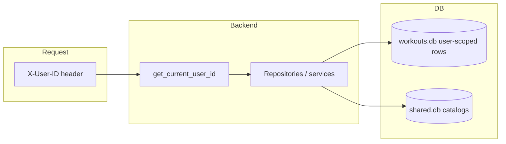
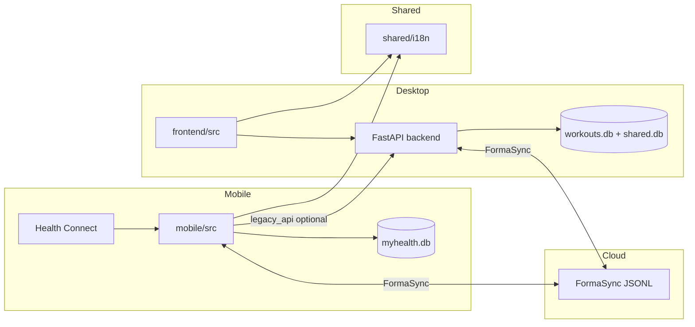
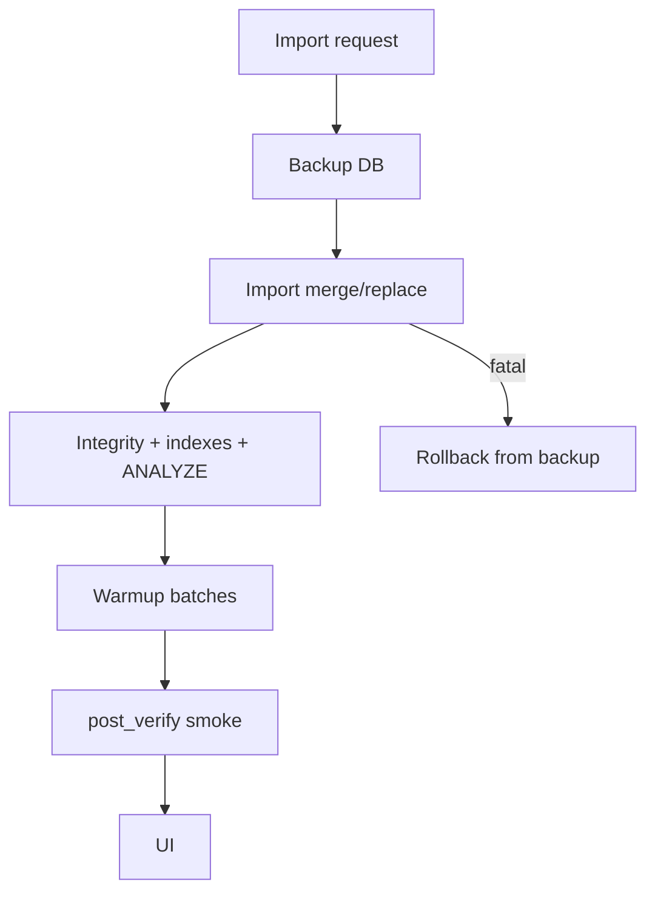
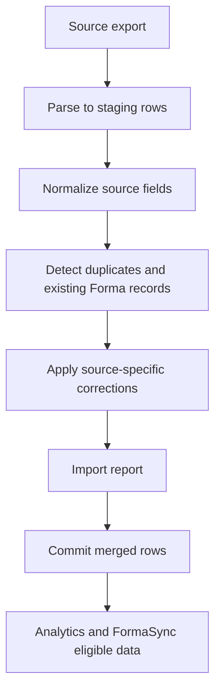

# ARCHITECTURE.md

Архитектура Forma: стабилизированный **desktop v1** (Vite + Electron + embedded FastAPI) и активно развиваемый **mobile** (React Native, локальная SQLite). Общий контракт — REST API, FormaSync JSONL и `shared/i18n`. Клиенты **не импортируют** код друг друга.

См. также: [PLATFORMS.md](./PLATFORMS.md), [PROJECT_CONTEXT.md](./PROJECT_CONTEXT.md), [WORKOUTS.md](./WORKOUTS.md), [NUTRITION.md](./NUTRITION.md).

Last updated: **2026-06-05**.

---

## Product Architecture State

| Принцип | Реализация |
|---------|------------|
| **Desktop v1** | Mostly feature-complete; stabilization, installer smoke, P0/P1 bugfixes |
| **Mobile** | Active development priority; standalone daily app scope, mobile-native UX |
| **Health Connect** | Integration/validation phase; mobile primary ingest, desktop views/analytics consume |
| **Sync** | FormaSync foundation implemented; validation phase for multi-device and conflicts |
| **Historical imports** | Planned; Xiaomi/Mi Fitness/Zepp Life staging + correction rules |
| **Desktop-only for now** | DB import/warmup, FIT/Polar pipeline, strength HR analytics depth, advanced food forecast, mini-db dev export |

---

## Структура приложения (desktop)

| Слой | Путь | Назначение |
|------|------|------------|
| Shell | `frontend/src/components/Layout.tsx` | Sidebar, `dashboard-shell`, wide tokens |
| Routes | `frontend/src/App.tsx`, `legacyRedirects.ts` | Активные страницы + redirect-only legacy |
| Pages | `frontend/src/pages/*` | Home, Workouts, Food, Body hub, Analytics, Settings, HC, Cycle |
| API | `frontend/src/api/*` | REST; `X-User-ID` + `client_mode` headers |
| Config | `frontend/src/config/clientCapabilities.ts` | `admin_browser` vs `desktop_app` feature flags |
| Backend | `backend/routers/*`, `backend/services/*` | Бизнес-логика, import, sync, analytics |
| Data | `database/`, `FORMA_DATA_DIR` | `workouts.db`, attach `shared.db` |

**Тело (`/body`):** hub с вкладками (`bodyHubConstants.ts`): обзор, контрольные замеры, ежедневный вес, шаги, сон, пульс, активность, Health Connect. Контрольные замеры — `Body.tsx` (hero, состав, динамика, история).

**Тренировки (`/workouts`):** strength/cardio/exercise-set surfaces. Strength uses flat DB rows plus block metadata for `normal` / `superset` / `circuit`; templates define structure, latest history defines working values. Details: [WORKOUTS.md](./WORKOUTS.md).

**Питание (`/food`):** week-first diary, products/composite dishes, meal plans in `workouts.db` (v070), shared product catalog in `shared.db`. Details: [NUTRITION.md](./NUTRITION.md).

---

## Ownership и изоляция данных



| Категория | Поведение |
|-----------|-----------|
| **User-scoped** | Workouts, food entries, body metrics, presets, steps, HC aggregates, Polar tokens (`local_user_id`), meal plans, cardio settings — фильтр/запись по `user_id` |
| **Personal presets** | `workout_presets` + children; dedup `(user_id, name COLLATE NOCASE)` при импорте |
| **Exercise groups** | User scope на связанных таблицах (миграции v68+) |
| **Import merge** | Staging ATTACH → copy с remap на **текущего** пользователя импорта |
| **Import replace** | Atomic swap + `user_id_remap` на user tables |
| **Browser import (dev)** | `POST /api/database/import/stage` — scoped к сессии, не «всегда user 1» |
| **System / shared** | `shared.db` — продукты и общие справочники; отдельные merge rules |
| **Cloud identity** | Yandex `uid` → папка `FormaSync/{uid}/`; локальный `users.id` — через OAuth / `link_user` |

Подробнее: [DATABASE.md](./DATABASE.md), [FORMA_SYNC.md](./FORMA_SYNC.md), [KNOWN_ISSUES.md](./KNOWN_ISSUES.md) (Data scope).

---

## Локальная и облачная модель данных

| Хранилище | Владелец | Sync |
|-----------|----------|------|
| `%APPDATA%\Forma\workouts.db` | Desktop user profile | FormaSync export/import; не whole-DB |
| `shared.db` | Attach | ZIP import/export вместе с workouts |
| `myhealth.db` | Mobile device user | FormaSync; native `FormaBackups/*.db` optional |
| Yandex `FormaSync/` | `yandex_uid` | JSONL packages, revision monotonic |
| Yandex `FormaBackups/` | Emergency full DB | Отдельно от FormaSync |

---

## Контуры системы



---

## Границы платформ

| Аспект | Desktop | Mobile |
|--------|---------|--------|
| UI runtime | React DOM, Electron | React Native |
| Primary storage | `workouts.db` + `shared.db` | `myhealth.db` |
| Импорт / warmup крупной БД | Да (Electron IPC + backend jobs) | Нет |
| FIT / Polar ingest | Backend | Нет |
| HC ingest | Backend ingest + hub UI | Локальный ingest + HC tab |
| Режимы | `admin_browser` / `desktop_app` (Vite) | `legacy_api` / `autonomous` / `cloud` / `local_hc_test` |
| Тяжёлая графика | Plotly, Leaflet | chart-kit, `analytics-engine/` |

**Metro (mobile):** `watchFolders` = только `shared/`; `blockList` — `frontend/`, `backend/`, `e2e/`, `venv/`, `archive/`. Проверка: `npm run check:platform-imports`.

**Не общий код:** `frontend/src` ↔ `mobile/src`. Дублирующая бизнес-логика (например `recoveryAdvice`, `formaWeek`) пока в двух деревьях — вынос в `shared/domain/` запланирован отдельно.

---

## Backend: слои чтения данных

| Слой | Назначение |
|------|------------|
| `database/connection.py`, `get_db()` | Пути `FORMA_DATA_DIR`, attach `shared.db` |
| `backend/database/active_db.py` | Активный контекст БД для diagnostics |
| `backend/repositories/` | Лёгкие read/count запросы (workouts, food, body, steps, analytics) |
| `backend/services/*` | Бизнес-логика, импорт, sync, analytics |
| `backend/routers/*` | HTTP API |

**Whitelist прямого SQLite вне `get_db()`:** `database_import_tasks`, `database_export_service` (копирование файлов). Новые обходы не добавлять.

**Diagnostics:** `GET /api/database/diagnostics/overview` — `activeDbPath`, `counts`, опционально `workout_visibility` ([DATABASE.md](./DATABASE.md)).

---

## Analytics (read path, desktop backend)

Цепочка training load на API:

```
cardio + HR → count_missing_trimp → refresh (если нужно) → daily TRIMP
  → analytics_query.get_ctl_atl_tsb_series → EWMA → API / dashboard home
```

- Модуль: [`backend/services/analytics_query.py`](../backend/services/analytics_query.py) — guards на пустую БД, `build_ctl_current`.
- Формулы CTL/ATL/TSB и Edwards TRIMP **не менялись** в cleanup 2026-06.
- `analytics_service.get_ctl_atl_tsb` делегирует в `analytics_query`.
- Calorie calibration: `analytics_service` сначала считает activity по правилу `bracelet - watch + Polar/chest effective workout calories`, затем применяет `calibration_factor` к итоговой activity-части. `calibration_service` пересчитывает фактор как `observed_deficit / predicted_deficit` по trend weight и сохраняет агрегаты окна в `calorie_calibration_history`; raw calories не перезаписываются.
- Planned automatic calibration: every 14 days collect weight trend, compare predicted vs observed deficit/surplus, update only correction coefficients, log event and confidence. Must never overwrite imported, Polar, Health Connect or workout calorie rows.

Подробнее: [ANALYTICS.md](./ANALYTICS.md).

---

## Import → warmup → UI (desktop)



Логика merge/replace и worker threads **не переписывалась** в cleanup 2026-06; добавлены diagnostics repo, analytics guards, документация и UI/data-layer уточнения.

После импорта: `database_post_verify` — в т.ч. CTL smoke только если есть cardio TRIMP в окне.

### Workout import pipeline: Polar HR

Polar/FIT ingest is backend-owned. Polar AccessLink payloads are staged in `polar_pending_workouts.raw_data`, then attach services parse scalar metrics and HR samples into workout tables:

1. `sync_polar.py` / upload flow stores pending workout metadata and raw JSON.
2. `polar_attach_service` attaches a pending row to cardio or strength workout rows.
3. `heart-rate.average` / `heart-rate.maximum` update scalar fields (`avg_hr`, `max_hr`, `calories_chest`) where applicable.
4. HR time-series samples are parsed from `samples[].data` and saved into `workout_heart_rate`.

Rule: do not rely only on `sample-type`. Known values (`1`, `0`, `HEART_RATE`) are hints, but parser must inspect the actual CSV content. If the payload contains `heart-rate` metadata and a sample block contains an HR-like series (`25-240 bpm` values), unknown `sample-type` should be treated as HR instead of being dropped silently. `recording-rate` defines the time step for `elapsed_sec`.

---

## Historical Import Architecture

Historical imports are planned and separate from live Health Connect ingestion. See [HISTORICAL_IMPORTS.md](./HISTORICAL_IMPORTS.md).

Target sources:

- Mi Fitness;
- Zepp Life;
- historical Xiaomi exports.

Pipeline:



Rules:

- Never blindly overwrite existing Forma records.
- Preserve raw imported values where possible.
- Store/log corrected values separately or with clear correction metadata.
- Merge by natural keys: date, time range, source, workout identity, measurement type.
- Correction must be reversible when feasible.

### Xiaomi Step Duplication Correction

Known affected range: approximately **September 2023 – December 2023**. Existing Forma monthly step totals are authoritative.

For each affected month:

```text
excess_steps = xiaomi_month_total - existing_forma_month_total
daily_correction = excess_steps / days_with_records
corrected_daily_steps = max(0, imported_daily_steps - daily_correction)
```

Only apply when `xiaomi_month_total > existing_forma_month_total`. Preserve raw imported daily steps, corrected daily steps, month totals and correction log. Details: [HISTORICAL_IMPORTS.md](./HISTORICAL_IMPORTS.md), analytics implications: [ANALYTICS.md](./ANALYTICS.md).

---

## Sync (кратко)

| Путь | Когда |
|------|--------|
| FormaSync | Инкремент JSONL на Yandex (`FormaSync/`) — default mobile/cloud |
| `legacy_api` | Mobile → полный REST sync к ПК |
| Native cloud backup | Android `.db` в `FormaBackups/` |
| Desktop cloud | Server-mediated backup через settings |

Детали: [FORMA_SYNC.md](./FORMA_SYNC.md), [DATABASE.md](./DATABASE.md), historical cleanup notes in [archive/CLEANUP.md](./archive/CLEANUP.md).

---

## Responsive desktop (UX principles)

- **Fluid data pages** — `AppPageShell width="fluid"`; формы остаются `narrow`/`medium`.
- **Ultra-wide не раньше времени** — multi-column только с 1200–1680px+; не сжимать laptop layouts ради sidebar.
- **Контрольные замеры** — график на всю ширину; история **всегда под графиком**; строка истории = chevron + дата + 8 ключевых метрик; раскрытие = полные секции.
- **Питание** — week grid; текущий день с **чёрной** окантовкой (`todayHighlightClass`).

См. [DESKTOP_UI.md](./DESKTOP_UI.md).

---

## Что не входит в архитектуру «как shipped»

- Единый monorepo UI package.
- Mobile import desktop-sized DB.
- JWT / multi-tenant hosted API.
- HRV/SpO₂ readiness в CTL.
- Mobile standalone completion (active development, not shipped-complete).
- Historical Xiaomi/Mi imports (planned).
