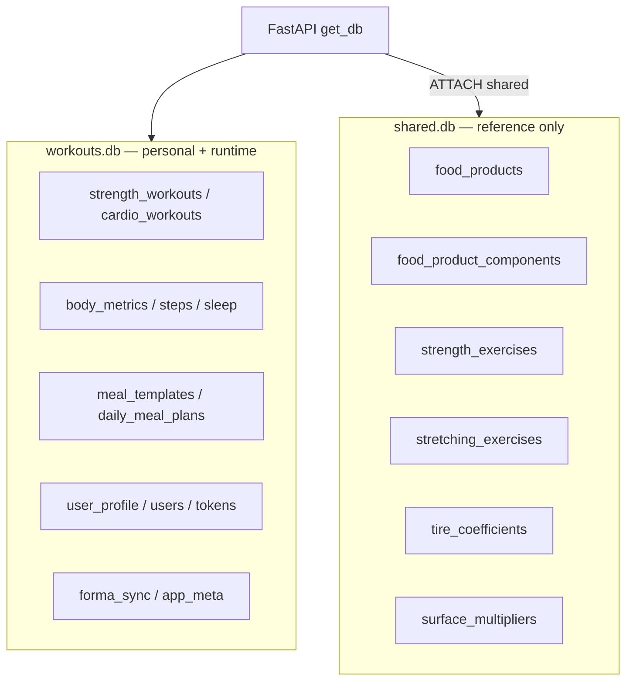

# DATABASE.md

Данные Forma: desktop **`workouts.db`** (личные) + **`shared.db`** (справочники), mobile **`myhealth.db`**.  
После миграций **v079** (рационы) и **v080** (силовой каталог) `shared.db` содержит только reference-данные; всё персональное живёт в `workouts.db`. Миграция **v078** добавляет `duration_sec` / `distance_km` в `cardio_workouts`.

Last updated: **2026-06-09**.

---

## Две базы desktop (текущая модель)

| База | Контур | Назначение |
|------|--------|------------|
| **`workouts.db`** | Desktop main (`FORMA_DATA_DIR`) | Тренировки, замеры, рационы, профиль, OAuth/cloud tokens, sync state, пользовательские настройки |
| **`shared.db`** | ATTACH к `workouts.db` | Общие справочники: продукты, растяжка, силовой каталог, lookup-таблицы велосипеда |
| **`myhealth.db`** | Mobile | Offline-first; FormaSync apply |

Desktop schema: **`SCHEMA_VERSION` = 80** (`database/migrations.py`). Latest public migrations:

- **v078** — `_migration_v078_cardio_duration_distance_km`: add normalized `duration_sec` / `distance_km` to `cardio_workouts`.
- **v079** — `_migration_v079_finalize_meal_plans_in_workouts`: reconcile legacy shared meal tables into `workouts.db`, purge shared copies, set `meal_plans_in_workouts_v1` and `shared_meal_plans_purged_v1`.
- **v080** — `_migration_v080_strength_catalog_populate_shared`: collect/dedupe strength names from workouts/templates/sets and write canonical rows to `shared.strength_exercises`.

Do not apply dev-repo numbering blindly: current Dev code still uses v078/v079 for the meal/strength steps and does not yet include Public's v078 cardio migration. Cross-repo reconciliation should be done by appending a future Dev reconciliation migration, not by renumbering existing history.

### Флаги маршрутизации (`app_meta`)

| Key | Значение | Смысл |
|-----|----------|--------|
| `meal_plans_in_workouts_v1` | `1` | Рационы читаются/пишутся в **main** (`workouts.db`) |
| `shared_meal_plans_purged_v1` | `1` | Таблицы рационов **удалены** из `shared.db` (v079) |
| `strength_catalog_in_shared_v1` | `1` | Канонический силовой каталог в `shared.strength_exercises` (v080) |
| `db_split_shared_v1` | `1` | Двухфайловый контур активен |

---

## `shared.db` — purpose (reference)

**Только несекретные справочники**, без `user_id`, без тренировок, без замеров.

| Таблица | Содержимое | Классификация |
|---------|------------|---------------|
| `food_products` | Каталог продуктов (макросы, порции) | reference |
| `food_product_components` | Состав составных продуктов | reference |
| `stretching_exercises` | Каталог упражнений на растяжку | reference |
| `strength_exercises` | Канонические названия силовых упражнений | reference |
| `tire_coefficients` | CRR шин (велосипед) | reference |
| `surface_multipliers` | Множители покрытия | reference |

**Не должно присутствовать** в актуальном `shared.db` после v079:

- `meal_*` таблицы рационов;
- `openfoodfacts_cache` (runtime cache);
- `cloud_tokens`, `polar_tokens`, `user_cloud_links`;
- любые workout/body/user таблицы.

Маршрутизация meal-plan SQL: `database/meal_plans_storage.py` (`meal_plan_schema()` → `main` после v079).

---

## `workouts.db` — purpose (personal)

| Категория | Примеры таблиц |
|-----------|----------------|
| **Workouts** | `strength_workouts`, `cardio_workouts`, `workout_heart_rate`, `workout_sensors`, `workout_gps_points`, `exercise_sets`, `exercise_set_items` |
| **Exercise history** | Фактические подходы в `strength_workouts`; legacy overlay `user_strength_exercises` (архив/сироты, не канон) |
| **Body / activity** | `body_metrics`, `steps_history`, `sleep_data`, `passive_heart_rate_samples`, `daily_bracelet_calories` |
| **Meal plans / rations** | `meal_templates`, `meal_template_items`, `daily_meal_plans`, `daily_meal_plan_templates`, `meal_plan_items`, `weekly_meal_schedule`, `food_entries` |
| **User profile & settings** | `user_profile`, `users`, nutrition targets, bike/cycle settings |
| **Auth / cloud linkage** | `cloud_tokens`, `polar_tokens`, `user_cloud_links`, `cloud_accounts` |
| **Sync / runtime** | `forma_sync_*`, `app_meta`, `openfoodfacts_cache` (если включён на desktop), `calorie_calibration_history` |

Все user-scoped таблицы фильтруются по `user_id` / `get_current_user_id()`.

---

## Public vs personal data

| Тип | Где хранится | Можно в GitHub? |
|-----|--------------|-----------------|
| **Reference / shared** | `shared.db` (6 таблиц выше) | Да, после санитизации |
| **Personal health** | `workouts.db` | **Никогда** |
| **Auth secrets** | `workouts.db` tokens | **Никогда** |
| **Meal plans** | `workouts.db` only (v079+) | **Никогда** |
| **Workout performance** | `workouts.db` | **Никогда** |
| **Runtime cache** | `openfoodfacts_cache`, sync queues | **Никогда** в публичном `shared.db` |

---

## Public Repository Data Policy

Публичный репозиторий (**Forma-Public**) и установщик для GitHub могут включать **только санитизированный `shared.db`**.

### Почему `shared.db` можно публиковать

- Содержит обезличенные справочники (продукты, упражнения, коэффициенты).
- Не содержит `user_id`, токенов, тренировок, веса, рационов, истории подходов.
- Собирается скриптом из dev-источника с явным whitelist таблиц.

### Почему `workouts.db` нельзя публиковать

- Единственный источник правды для всей истории здоровья пользователя.
- Содержит OAuth tokens, cloud linkage, персональные рационы, замеры, тренировки.
- Даже «пустой» shrink-seed для installer — это шаблон схемы в `packaging/seed/`, не файл для GitHub.

### GitHub-safe generation

| Шаг | Команда / файл |
|-----|----------------|
| 1. Сборка | `python scripts/build_public_shared_db.py --source <sanitized-source> --target shared.db` |
| 2. Аудит | `python scripts/audit_public_shared_db.py shared.db` → **READY FOR GITHUB** |
| 3. Публикация | Коммитить только audited `shared.db` (6 reference tables) |
| 4. Installer seed | `npm run desktop:prepare-seed` — migration-based `workouts.db` + audited `shared.db` template |

Whitelist в `build_public_shared_db.py`: `food_products`, `food_product_components`, `stretching_exercises`, `strength_exercises`, `tire_coefficients`, `surface_multipliers`.  
Blacklist: meal plans, OFF cache, workout/history/body/user/auth/cloud/polar tables. `audit_public_shared_db.py` must print **READY FOR GITHUB** before a generated `shared.db` is published.

**Правило:** не коммитить dev `workouts.db`, dev `shared.db` целиком, `*.bak`, `import-jobs/`.

### Installer seed ownership

`packaging/seed/` is a runtime bootstrap artifact, not a source-of-truth database:

- `shared.db`: starts from audited root/template `shared.db`; meal-plan tables and runtime caches must be absent.
- `workouts.db`: built from migrations via `scripts/build_packaging_workouts_seed.py`; do not copy a developer `workouts.db`.
- `scripts/check_packaging_secrets.py` rejects missing seeds, seeds over the size cap, dev `.env` references, forbidden OAuth secrets, missing public client IDs, and missing `httpx`/`httpcore` in the packaged backend.

This is separate from the public root `shared.db` publication flow above.

---

## Ключевые миграции (schema)

| Version | Назначение |
|---------|------------|
| v070 | Первичный перенос meal-plan таблиц в `workouts.db` |
| v071–v074 | Block metadata, catalog archive, calibration history |
| v077 | `exercise_category` separation; cleanup bulk strength seed |
| **v078** | `cardio_workouts`: `duration_sec` / `distance_km` (legacy `duration` / `distance`) |
| **v079** | Финализация рационов в `workouts.db`; purge meal tables из `shared.db` |
| **v080** | Дедуп имён из workouts → `shared.strength_exercises`; flag `strength_catalog_in_shared_v1` |

### Migration History — Dev/Public Equivalence

| Public migration | Public purpose | Current Dev equivalent | Reconciliation status |
|------------------|----------------|------------------------|-----------------------|
| **v078** | `cardio_workouts.duration_sec` / `distance_km`; backfill from legacy `duration` / `distance` | None in Dev `_SCHEMA_MIGRATIONS` | **Missing in Dev**; future Dev v080 should add this idempotently |
| **v079** | Meal finalization into `workouts.db`; shared meal purge; main meal-table hardening | Dev **v078** | Mostly equivalent; Public has extra clean-install hardening |
| **v080** | Populate canonical `shared.strength_exercises` | Dev **v079** | Logical equivalent |

Current code state: Public is `SCHEMA_VERSION=80`; Dev is `SCHEMA_VERSION=79`. The repositories are **not yet fully schema-equivalent in code**. Future shared migration work should continue from v081+ only after Dev has an approved appended reconciliation migration.

---

## Слой чтения (backend)

| Компонент | Путь |
|-----------|------|
| App connection | `backend/database/db_utils.py` → `get_db()` |
| Shared attach | `database/connection.py`, `shared_table()` |
| Meal routing | `database/meal_plans_storage.py` |
| Strength catalog | `backend/services/exercise_catalog_service.py` → shared canonical |
| Репозитории | `backend/repositories/` |
| Diagnostics | `backend/services/database_diagnostics_service.py` |

**Правило:** новые read-path — через `get_db()` / repositories, не прямой `sqlite3.connect` в сервисах.

---

## Diagnostics API (desktop)

`GET /api/database/diagnostics/overview` — `activeDbPath`, `counts`, `shared_attached`, optional `workout_visibility`.

UI: Settings → Данные.

---

## Импорт большой БД (desktop)

Импорт **файлов** `workouts.db` + `shared.db` (ZIP или два файла). См. staging в `import-jobs/{jobId}/`.

| Режим | Поведение |
|-------|-----------|
| **replace** | Atomic swap обоих файлов + `ensure_db_schema` + user reconcile |
| **merge** | ATTACH staging; copy с remap на текущего `user_id` |

**Cloud restore** (`POST /api/cloud/backup/restore`): заменяет только **`workouts.db`**; `shared.db` не трогается.

**Import merge для `food_products`:** natural key `name`, catalog merge (не по `id`).

После v079 импорт старого `shared.db` с meal tables не восстанавливает рационы в shared — миграция переносит в main и purge.

Подробности reconcile: `backend/services/import_user_reconciliation.py`, `db_import_conflict_handlers.py`.

Тесты: `test_meal_plans_v079_migration.py`, `test_packaging_seed_audit.py`, `test_db_import_unique_conflicts.py`.

---

## Warmup после импорта

`POST /api/account/warmup/start` — фоновый worker; секции TRIMP, aggregates, CTL/ATL/TSB (guards на пустую БД).

---

## Экспорт (аварийный)

ZIP `workouts.db` + `shared.db` + `manifest.json` — полный desktop backup (личные + справочники).  
**Не путать** с `shared.public.db` для GitHub.

---

## Large DB behavior

- Replace по умолчанию для крупных БД (~150 MB+).
- Lock `.db-import.lock` → API 503 `import_in_progress`.
- Post-import: indexes, light ANALYZE, фоновый warmup.

## Known import issues

| Issue | Status |
|-------|--------|
| Wrong user after OAuth | Documented — `link_user` / Data scope |
| Cloud restore empty history | **Resolved** — reconcile к session `user_id` |
| UNIQUE on merge tables | Handlers in `db_import_conflict_handlers.py` |

## Ограничения

- Крупный импорт остаётся долгим на слабом диске.
- Mobile не выполняет desktop import/warmup.
