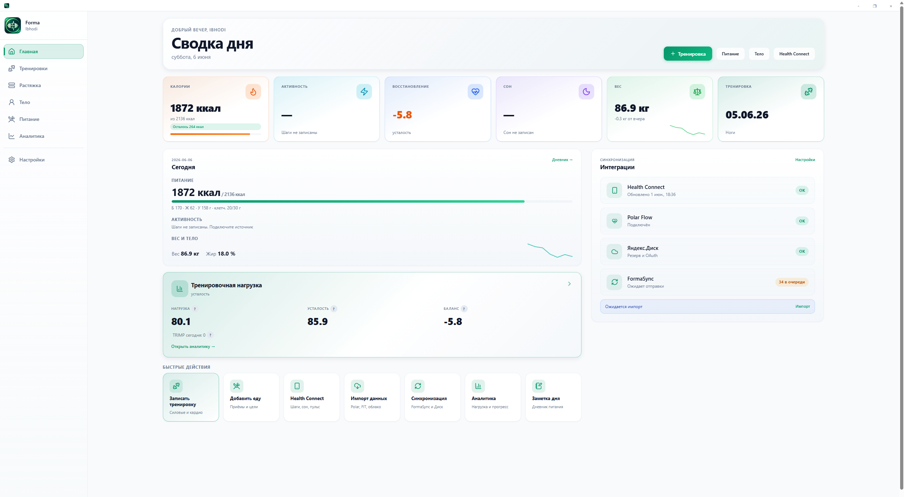
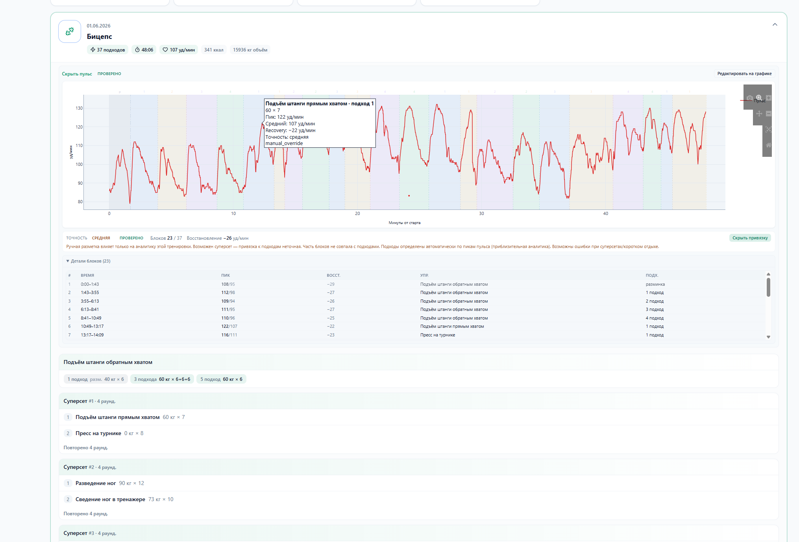
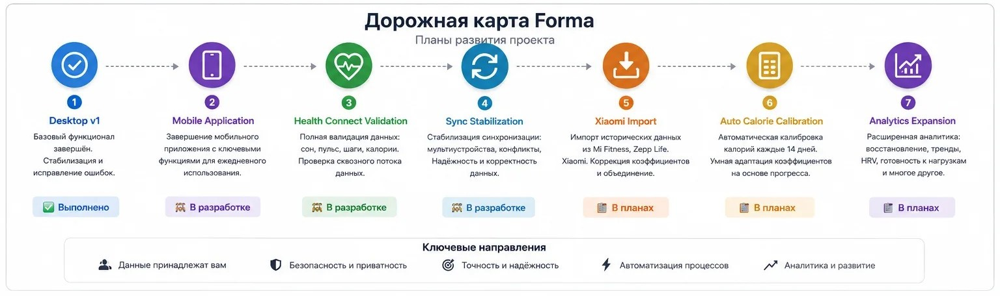

# Forma — GitHub README draft (archived 2026-06-09)

Marketing README preserved before merge with technical [`../README.md`](../README.md).

---

Forma - GitHub README (черновик для публикации)

Описание проекта

Forma — личная фитнес-платформа для хранения, анализа и синхронизации данных о тренировках, питании и показателях тела.

Проект появился как попытка объединить более шести лет спортивных данных, которые постепенно расползлись по десяткам Excel-файлов.

## История проекта

Forma появилась как попытка объединить более 6 лет спортивных данных,
которые до этого хранились в тетрадях, заметках телефона и нескольких
десятках Excel-файлов.

За 12 дней была создана первая рабочая версия платформы:

- Electron desktop приложение
- FastAPI backend
- React frontend
- синхронизация через Яндекс.Диск
- интеграция Polar
- аналитика тренировок и восстановления

Проект разрабатывался одним человеком как личная система учёта тренировок.

Возможности
• Журнал тренировок
• История упражнений
• Импорт данных Polar
• Аналитика пульса
• Калькулятор калорий
• История веса
• Синхронизация через Яндекс.Диск

Технологии
Frontend: React + TypeScript + Vite
Desktop: Electron
Backend: FastAPI + Python
Database: SQLite

Силовая тренировка с аналитикой пульса

Велотрек и телеметрия

Калькулятор калорий

Архитектура

Статистика проекта
• 500+ силовых тренировок
• 199 пробежек
• 82 велотренировки
• 28 плаваний
• 40+ документов
• 100–130 тыс. строк кода

## Статус проекта (marketing snapshot)

Текущий статус: MVP завершён

✅ Desktop приложение работает
✅ Импорт данных Polar работает
✅ Синхронизация через Яндекс.Диск работает
🚧 Mobile клиент находится в разработке
🚧 Интеграция Health Connect находится в разработке

Roadmap

## Почему проект открыт

Проект опубликован в открытом доступе в образовательных целях.

Он показывает, что один человек без профессионального опыта в разработке
может создать полноценное desktop-приложение, используя современные ИИ-инструменты.
