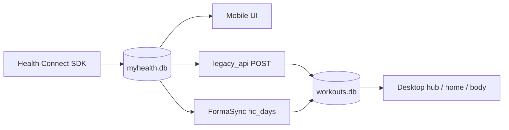
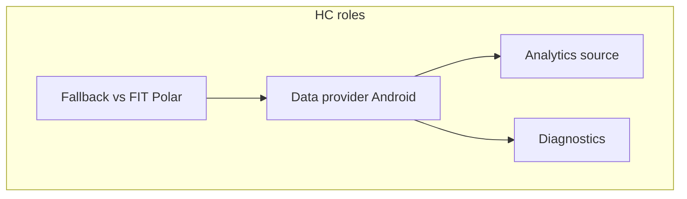
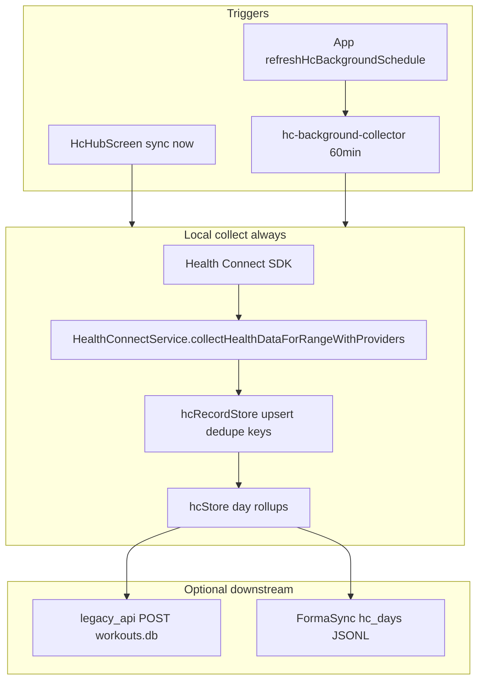
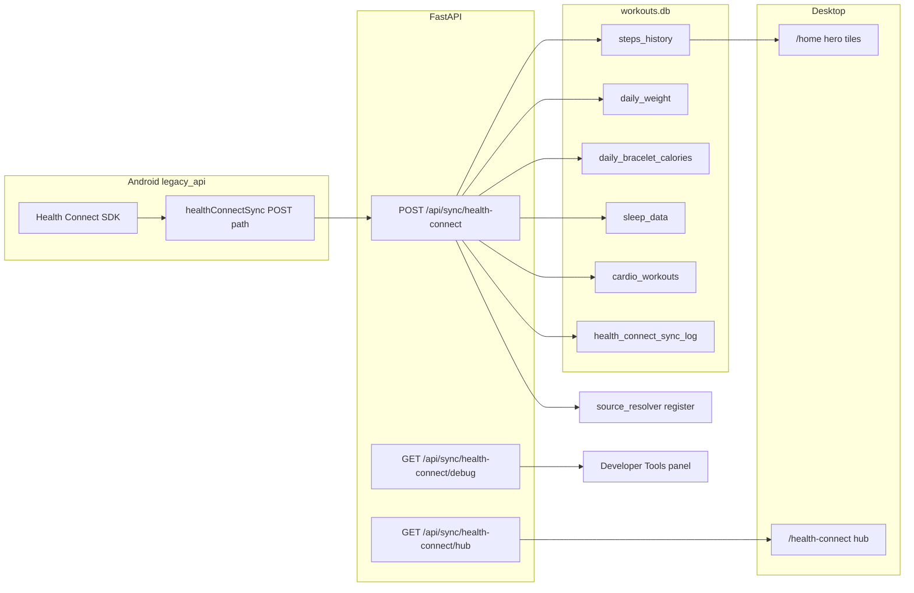

# HEALTH_CONNECT.md

Интеграция **Android Health Connect** с Forma. Mobile — primary ingest; desktop — hub + dashboard cards + analytics inputs. Текущий статус: **integration / validation phase**.

См. также: [MOBILE.md](./MOBILE.md), [FORMA_SYNC.md](./FORMA_SYNC.md), [DESKTOP_UI.md](./DESKTOP_UI.md), [ANALYTICS.md](./ANALYTICS.md). Аудит: [archive/HEALTH_CONNECT_AUDIT.md](./archive/HEALTH_CONNECT_AUDIT.md).

Last updated: **2026-06-05**.

---

## Desktop health dashboard

| Surface | Path | Содержание |
|---------|------|------------|
| HC hub | `/health-connect` | Steps, sleep, vitals, sync log, diagnostics |
| Body hub | `/body?tab=health-connect` | HC card в контексте «Тело» |
| Home | `/home` | Steps today, calories bridge, links → body/HC |
| Body overview | `/body` (overview tab) | Мини-тренды шаги/сон/пульс → deep links |

Guard: HC nav скрывается если `!enableHealthConnectNav` ([`clientCapabilities.ts`](../frontend/src/config/clientCapabilities.ts)).

---

## Поддерживаемые данные

| Тип | Desktop | Mobile | Sync |
|-----|---------|--------|------|
| Steps | ingest + hub | ingest + UI | `hc_days` / aggregates |
| Sleep | ingest + hub | partial | aggregated |
| HR samples | partial | partial | не raw flood |
| Calories | partial | partial | bracelet kcal paths |
| HC workouts | partial | partial | source resolver vs FIT/Polar |
| HRV / SpO₂ | placeholder | placeholder | **not shipped** |

---

## Current Validation Priorities

1. Sleep import validation.
2. Heart rate import validation, including continuous samples and daily summaries.
3. Step import validation, including duplicate behavior.
4. Calorie import validation and interaction with expenditure calibration.
5. Synchronization verification: mobile local DB → FormaSync/legacy API → desktop views.

Open questions:

- **Source attribution:** how to expose provider/package ownership when multiple providers write the same metric.
- **Duplicate prevention:** whether daily step/calorie totals should sum, pick dominant provider, or follow user priority.
- **Metric ownership:** when HC is fallback vs authoritative for steps, sleep, calories and workouts.
- **Conflict resolution:** how HC day rollups interact with manual edits, FIT/Polar workouts and FormaSync conflicts.

---

## Pipeline

1. Mobile читает HC → локальные таблицы.
2. Desktop: `POST /api/sync/health-connect` (legacy) и/или FormaSync apply.
3. `should_block_hc_write()` — FIT/Polar/manual имеют приоритет ([`source_resolver_service`](../backend/services/source_resolver_service.py)).

**CTL:** HC **не** источник CTL (CTL = cardio TRIMP only).

---

## Ограничения

- Mi Fitness: сначала sync в источнике → HC → Forma.
- Step double-count при нескольких HC records за день.
- Background delay (OEM battery).
- Desktop ↔ mobile full analytics parity is not guaranteed; mobile must still provide usable local analytics.

---

---

## Роли Health Connect в Forma

| Роль | Описание |
|------|----------|
| **Data provider** | На Android HC SDK читает шаги, сон, пульс, калории, тренировки → локальная SQLite (`hc_records`, `hc_day_metrics`) и опционально POST на ПК / FormaSync `hc_days`. |
| **Diagnostics module** | `hc_sync_runs`, debug API, stale badges, developer screens — понять *почему* данных нет. |
| **Analytics source** | Шаги и сон питают `/home`, expenditure, recovery advice; пульс — кардио и passive HR. **Не** источник CTL (CTL = кардио TRIMP). |
| **Fallback source** | Когда нет Polar/FIT/manual — bracelet kcal, steps, HC cardio; при конфликте с FIT/Polar действует `should_block_hc_write()` (`source_resolver_service` — [ARCHITECTURE.md](./ARCHITECTURE.md)). |

### Метрики: implemented vs planned

| Metric | Mobile collect | Desktop hub | Analytics use |
|--------|----------------|-------------|-----------------|
| **Steps** | yes | `HcStepsSection` | `/home` activity tile, expenditure |
| **Sleep** | yes | `HcSleepSection` | `/home` sleep tile, recovery partial |
| **Heart rate samples** | yes | min/max, resting estimate | cardio TRIMP, passive HR |
| **Resting HR** | estimate from samples | vitals card | partial |
| **Active/total calories** | yes | vitals / energy | deficit partial |
| **HRV** | — | placeholder UI | **planned** |
| **SpO₂** | — | placeholder UI | **planned** |
| **Respiratory rate** | — | — | **planned** |
| **Stress / recovery score** | — | placeholder | **planned** |

Permissions: Android HC permission sheet on first collect; `permission_denied` path does not crash background worker.

---

## Статус по областям

| Область | Статус |
|---------|--------|
| HC sync ingest (steps, weight, kcal, sleep, cardio) | **implemented** |
| Production hub UI `/health-connect` | **implemented** |
| Debug API + audit log (v50) | **implemented** |
| Source routing + HC write block | **implemented** |
| Dashboard `/home` tiles (steps, sleep) | **implemented** |
| Dashboard `/health-connect` hub | **implemented** |
| Mobile local SQLite (`hc_records`, `hc_day_metrics`) | **implemented** |
| Mobile HC background collector (60 min) | **implemented** |
| Mobile legacy POST to PC API | **implemented** (`legacy_api`) |
| FormaSync export `hc_days` | **implemented** (`autonomous` / `cloud`) |
| Mobile foreground + manual hub sync | **implemented** |
| Bracelet kcal in expenditure/deficit | **partial** |
| Sleep in recovery advice | **partial** |
| Reliability scoring UI | **experimental** (backend only) |
| HRV / readiness recovery analytics | **planned** |
| Full HC field catalog on `/analytics` | **planned** |
| Sleep / HR / step provider validation | **open validation** |
| Source attribution and conflict policy | **open design/validation** |

---

## Mobile local-first pipeline (Android)

| Модуль | Путь |
|--------|------|
| Оркестрация | [`mobile/src/services/healthConnectSync.ts`](../mobile/src/services/healthConnectSync.ts) — `executeLocalCollect`, `runHealthConnectLocalRead` |
| Чтение HC | [`mobile/src/services/HealthConnectService.ts`](../mobile/src/services/HealthConnectService.ts) |
| Фоновая задача | [`mobile/src/services/hcBackgroundTask.ts`](../mobile/src/services/hcBackgroundTask.ts) — task `hc-background-collector` |
| Планировщик | [`mobile/src/services/hcBackgroundScheduler.ts`](../mobile/src/services/hcBackgroundScheduler.ts) |
| Окно инкремента | [`mobile/src/services/hcReadWindow.ts`](../mobile/src/services/hcReadWindow.ts) — 36 h floor, 4 h overlap |
| Сырые записи | [`mobile/src/database/hcRecordStore.ts`](../mobile/src/database/hcRecordStore.ts) |
| Дневные метрики | [`mobile/src/database/hcStore.ts`](../mobile/src/database/hcStore.ts) — `computeStaleFlags`, dominant provider |
| Нормализация HR | [`mobile/src/services/heartRateNormalize.ts`](../mobile/src/services/heartRateNormalize.ts) |
| Регистрация задачи | [`mobile/index.js`](../mobile/index.js) (import `hcBackgroundTask`) |

**Устаревший путь:** [`healthConnectBackgroundSync.ts`](../mobile/src/services/healthConnectBackgroundSync.ts) — только re-export; в документации не использовать.

### Фоновый импорт

- **Планировщик:** `expo-background-task` → WorkManager на Android, `minimumInterval: 60` мин (`BACKGROUND_INTERVAL_MIN`).
- **Регистрация:** после входа `HcBackgroundBootstrap` в [`mobile/App.tsx`](../mobile/App.tsx) → `refreshHcBackgroundSchedule()`.
- **Условия:** Android, модуль HC включён, collector включён (`hcCollectorSettings`), режим `legacy_api` или local-first (`autonomous` / `cloud`); **не** `local_hc_test`.
- **Поведение:** `ensureHealthConnectReady({ requestPermissions: false })` — при отзыве разрешений фаза debug `permission_denied`, без throw; задача завершается `Success` (не зацикливается unregister).
- **Ограничение OS:** worker Expo требует **NetworkType.CONNECTED** — локальное чтение может откладываться офлайн, хотя данные не требуют сети.
- **Не реализовано:** `BOOT_COMPLETED` receiver, foreground service, in-app battery optimization UI.

### Шаги

- `readRecords('Steps', timeRange)` → сумма `count` по календарному дню → строки `hc_records` (`recordType: steps`) → rollup в `hc_day_metrics.steps`.
- **Риск двойного подсчёта:** несколько step-записей за день **суммируются**; отдельного dedup по источнику нет (см. [KNOWN_ISSUES.md](./KNOWN_ISSUES.md)).
- Validation priority: compare provider day totals against source apps and desktop `steps_history`; decide whether dominant-provider or user-priority rules are required.

### Пульс (heart rate)

- Читаются **непрерывные сэмплы** `HeartRate` с пагинацией `pageToken`; поля `block.samples[]` → `{ time, bpm }`.
- `normalizeHeartRatePoints`: сортировка, отброс BPM вне 25–240, **dedupe по ISO timestamp**.
- `bucketHeartRateByLocalDay` → `heart_rate_samples` в дневном payload.
- Те же точки используются для `avg_hr` / `max_hr` в тренировках (`readWorkoutsInRange`).
- **Не реализовано:** minute-level aggregates, `RestingHeartRate`, отдельный тип «continuous HR» в HC API.
- Validation priority: verify continuous samples are present for the expected providers and survive local storage/sync without timestamp duplication.

### Сон

- Sleep is supported in ingest and hub views, but validation is still required across providers.
- Open questions: nap vs night handling, overlapping sessions, provider priority, and how sleep confidence should feed recovery advice.

### Дедупликация (слои)

| Слой | Механизм |
|------|----------|
| HR samples | Одинаковый `timestamp` → пропуск |
| `hc_records` | Ключ `hc:{type}:{metadataId}` или `hc:{type}:{start}:{end}:{provider}` |
| `hc_day_metrics` | `INSERT OR REPLACE`; без изменения payload — без лишнего pending |
| FormaSync queue | Отдельно в [`syncQueue.ts`](../mobile/src/sync/syncQueue.ts) |

### Источники (source attribution)

- **Не** backend [`source_resolver_service`](../backend/services/source_resolver_service.py) — он для cardio в `workouts.db`.
- На телефоне: подсчёт записей по `dataOrigin` (package name) → **dominant origin** (максимум по count) в `providers_json` на `hc_day_metrics`.
- `computeStaleFlags` / `getStaleProviders`: если поле не менялось 48 h после `last_read_at` → stale badge в UI (`HcTrendsPanel`, hub).
- **Planned:** пользовательский приоритет источников, арбитраж пересекающихся step totals.
- Until this is finalized, diagnostics should show provider/package evidence rather than silently hiding conflicts.

### Инкрементальное окно

| Триггер | Окно |
|---------|------|
| `initial` | 7 / 14 / 30 дней (`resolveInitialWindow`) |
| `manual`, `background` | `resolveIncrementalWindow`: max(now−36h, lastRead−4h) … now |
| Явный `from`/`to` | диапазон пользователя; если `from >= to` → последние 24 h |

Watermark: `hc:last_local_read_at` ([`hcModuleSettings.ts`](../mobile/src/services/hcModuleSettings.ts)).

`fullHrResync` влияет только на **legacy POST** (`resolveSyncFrom`, overlap 6 h) — **не** на локальное `resolveReadWindow`.

### Retry

- HC background: один проход; при ошибке `hc_sync_runs.status = error`; повтор — по расписанию OS.
- FormaSync: очередь с backoff — см. [FORMA_SYNC.md](./FORMA_SYNC.md).

---

## Desktop pipeline (legacy API ingest)

---

## API

| Метод | Путь | Назначение | UI |
|-------|------|------------|-----|
| POST | `/api/sync/health-connect` | Batch по дням | Mobile sync |
| GET | `/api/sync/health-connect/debug` | Raw diagnostics | Dev tools |
| GET | `/api/sync/health-connect/hub` | Hub aggregate | `/health-connect` |

Роутер: [`backend/routers/sync.py`](../backend/routers/sync.py).

Сервисы:

- [`health_connect_sync_service.py`](../backend/services/health_connect_sync_service.py) — ingest
- [`health_connect_debug_service.py`](../backend/services/health_connect_debug_service.py) — debug payload
- [`health_connect_hub_service.py`](../backend/services/health_connect_hub_service.py) — hub view
- [`health_connect_mapping.py`](../backend/services/health_connect_mapping.py) — field catalog
- [`health_connect_audit.py`](../backend/services/health_connect_audit.py) — skip/save reasons
- [`health_connect_reliability.py`](../backend/services/health_connect_reliability.py) — scoring (**partial**)

---

## Payload (один элемент batch на день)

| Поле | Таблица |
|------|---------|
| `steps` | `steps_history` (`source=health_connect`) |
| `total_calories` / `active_calories` | `daily_bracelet_calories` |
| `weight_kg` | `daily_weight` |
| `sleep` | `sleep_data` |
| `workouts[]` | `cardio_workouts` + optional `workout_heart_rate` |

Skip rules (examples):

- Strength exercise type (70) → `SKIP_UNSUPPORTED_TYPE`
- Day-level HR without workout → `SKIP_HR_WITHOUT_WORKOUT`
- Existing FIT/Polar/manual workout → `should_block_hc_write()`

---

## Source routing foundation

HC cardio registrations go through [`source_resolver_service`](../backend/services/source_resolver_service.py):

- `register_health_connect_workout()` on new rows
- `should_block_hc_write()` protects FIT/Polar/manual/Excel ownership

См. [ARCHITECTURE.md](./ARCHITECTURE.md) § Source resolver.

---

## Lazy / manual sync providers (Mi Fitness pattern)

**Operational limitation** — см. [KNOWN_ISSUES.md](./KNOWN_ISSUES.md).

Некоторые провайдеры (Mi Fitness, Xiaomi-style apps) **не синхронизируют данные в Health Connect автоматически**:

1. Пользователь должен **открыть приложение-источник** (Mi Fitness, Zepp, …)
2. Вручую инициировать sync **источник → Health Connect**
3. Только после этого Forma mobile sync может прочитать свежие records

**Symptoms:**

- Пустые или stale дни в hub
- `last_sync` давно, но пользователь «носил браслет»
- Debug: counts не растут без manual provider sync

**Mitigation (implemented):**

- Hub показывает date ranges и last sync
- Mobile re-sync on app start + background schedule
- Debug audit JSON с skip reasons
- User education: проверить sync в Mi Fitness → HC

**Not fixable on backend** without fresh HC records on the phone.

---

## Mapping layer

Каталог: [`health_connect_mapping.py`](../backend/services/health_connect_mapping.py).

| HC field | Reliability |
|----------|-------------|
| steps | primary |
| total_calories | primary |
| weight_kg | primary |
| sleep | primary |
| active_calories | fallback if no total |
| workouts | partial — type mapping; strength skipped |
| heart_rate_samples | only with created cardio workout |

Exercise type examples: run (56), bike (8/9), swim (73/74) → `cardio_workouts.type`.

---

## Database tables

| Таблица | Migration | Purpose |
|---------|-----------|---------|
| `sleep_data` | v41 | Sleep records |
| `health_connect_sync_log` | v48 | Sync journal |
| `audit_json`, `mobile_audit_json`, `device_label` | v50 | Audit columns |
| `steps_history`, `daily_weight`, `daily_bracelet_calories` | earlier | `source=health_connect` |

---

## UI surfaces

| Surface | Component | Status |
|---------|-----------|--------|
| `/health-connect` | `HealthConnectHubContent` | **production** hub |
| `/home` | Hero «Активность», «Сон»; status in integrations panel | **production** |
| Settings → Dev Tools | `HealthConnectDiagnosticsPanel` | **experimental** raw JSON |
| Mobile tab HC | `HcHubScreen`, `HcTrendsPanel` | **production** hub |
| Mobile Settings | `HealthConnectSettings.tsx` | **production** (integrations) |
| Mobile diagnostics | `HealthConnectDiagnosticsScreen` | **developer mode** (7 taps on version in About); always in `local_hc_test` |

Deep link: `/settings?tab=about` → Developer Tools; legacy `sync_cloud` → `sync`.

Six-layer audit matrix: [archive/HEALTH_CONNECT_AUDIT.md](./archive/HEALTH_CONNECT_AUDIT.md).

---

## Analytics integration

| HC data | Desktop (`workouts.db`) | Mobile local (`myhealth.db`) |
|---------|-------------------------|------------------------------|
| Steps | `/body`, `/home` | `HcTrendsPanel`, `useStepsHistory` (local-first when API down) |
| Bracelet kcal | Expenditure / deficit | day metrics cache (**partial**) |
| Sleep | Recovery advice | hub trends (**partial**) |
| HC cardio | Cardio history | `cardio_workouts_cache` + analytics |
| HRV / readiness | — | **planned** |

**Desktop:** HC is **not** the recovery/readiness engine; many ingested fields not on `/analytics`.

**Mobile:** локальная аналитика читает `hc_day_metrics`; полный паритет с desktop Plotly — **нет**.

### Future dependency: recovery-aware analytics

Recovery-aware analytics is **planned / not started**. It should only be implemented after reliable HC and historical import validation for:

- sleep;
- continuous heart rate;
- resting heart rate;
- night heart rate;
- steps;
- HRV if available.

HC should provide validated inputs; the analytics layer should produce derived recovery/readiness interpretation without overwriting raw HC records.

---

## Mobile SQLite tables

| Таблица | Назначение |
|---------|------------|
| `hc_records` | Сырые/нормализованные записи HC с dedupe key |
| `hc_day_metrics` | Дневной rollup + `providers_json` + stale flags |
| `hc_sync_runs` | Журнал collect (trigger, status, counts) |

Схема: [`mobile/src/database/index.ts`](../mobile/src/database/index.ts) (`SCHEMA_VERSION`).

---

## Troubleshooting

| Symptom | Action |
|---------|--------|
| Stale data (Mi Fitness) | Manual sync in source app → HC, then Forma mobile sync |
| Empty hub | Check HC permissions, API URL, `X-User-ID` |
| Workouts missing | Debug → skip reasons; strength type 70 always skipped |
| HC overwrites FIT ride | Should not happen — check `should_block_hc_write` / resolver |
| Debug 404 | Restart backend; verify route exists |
| Step totals too high | Check multiple providers and known Xiaomi duplication/correction plans |
| Sleep/HR missing after phone sync | Verify source app → HC first, then Forma mobile local read, then FormaSync/legacy transfer |

---

## См. также

- [ARCHITECTURE.md](./ARCHITECTURE.md)
- [MOBILE.md](./MOBILE.md)
- [KNOWN_ISSUES.md](./KNOWN_ISSUES.md)

---

## Smoke checklist after hotfixes

Цель: убедиться, что хотфиксы UI/OAuth/вкладок не сломали рабочий путь Health Connect.

1. Android устройство: открыть `Health Connect` hub в mobile.
2. Проверить, что модуль включен и последнее чтение обновляется после `Синхронизировать сейчас`.
3. Убедиться, что после ручного чтения в hub есть данные (если они есть в HC источнике):
   - шаги;
   - сон;
   - пульс (сводка за день).
4. Открыть настройки `Health Connect` и проверить, что включены типы данных: `steps`, `sleep`, `heart_rate`, `calories`, `workouts`.
5. Проверить, что `runHealthConnectLocalRead` не возвращает ошибку permissions при уже выданных доступах.
6. Если режим `legacy_api`: выполнить `Отправить на ПК` и убедиться в успешном статусе без падений.

Примечание: в рамках хотфиксов не изменять импорт HC, permissions flow, dedup или общий рабочий pipeline без прямого бага.
