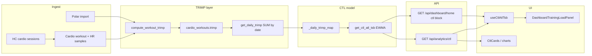

# Analytics architecture

End-to-end pipeline для training load, TRIMP и связанных метрик в Forma.

**User-facing overview:** [ANALYTICS.md](./ANALYTICS.md)

Last updated: 2026-05-30.

---

## Data pipeline



---

## TRIMP calculation

| Step | Location |
|------|----------|
| Per workout | `cardio_service.compute_workout_trimp(workout_id)` |
| Algorithm | Edwards TRIMP via `utils/hr_profile.compute_edwards_trimp` |
| Persist | `cardio_workouts.trimp` |
| Backfill | `refresh_missing_trimp(limit)` for rows with HR but null trimp |
| Daily aggregate | `get_daily_trimp(date_from, date_to)` → `{date, trimp}` sum per day |

**Not in TRIMP:** strength sets, steps alone, sleep.

---

## CTL / ATL / TSB

**Service:** `backend/services/analytics_service.py` → `get_ctl_atl_tsb(days)`

```python
# For each calendar day d in [start, end]:
t = daily_trimp[d]  # 0 if no cardio
load = t * recovery_multiplier[d]  # 1.0 default; cycle service for female profiles

CTL = CTL_prev * (41/42) + load/42   # first day: CTL = load
ATL = ATL_prev * (6/7) + load/7
TSB = CTL - ATL
```

| Constant | Meaning |
|----------|---------|
| 42 | CTL time constant (~6 weeks) |
| 7 | ATL time constant (~1 week) |

**Output row:** `{date, trimp, ctl, atl, tsb}` (rounded 1 decimal).

### `days` parameter

- Loads TRIMP only for `[today - days + 1, today]`.
- EWMA **starts cold** at window start — **short windows inflate metrics**.
- **Default:** `CTL_ATL_TSB_DEFAULT_DAYS = 90` (`frontend/src/shared/trainingLoadMetrics.ts`).
- Dashboard home and analytics should use the **same** `days` for comparable numbers.

---

## API response shape

`CtlAtlTsbResponse`:

```json
{
  "items": [{"date": "...", "trimp": 0, "ctl": 73.5, "atl": 76.5, "tsb": -3.0}],
  "current": {
    "ctl": 73.5,
    "atl": 76.5,
    "tsb": -3.0,
    "trimp": 202.0,
    "last_workout_date": "2026-05-28"
  }
}
```

| Field | Semantics |
|-------|-----------|
| `items[].trimp` | Daily sum — use for **TRIMP сегодня** on home |
| `current.trimp` | Last **workout** with trimp > 0 — analytics card only |
| `current.ctl/atl/tsb` | Last day in series |

Built in:

- `backend/routers/analytics.py` — `api_get_ctl_atl_tsb`
- `backend/services/dashboard_home_service.py` — `_ctl_block(90)`

---

## Frontend data layer

| Piece | Role |
|-------|------|
| `fetchCtlAtlTsb(days)` | `frontend/src/api/analytics.ts` |
| `useCtlAtlTsb()` | React Query `queryKeys.ctlAtlTsb(days)` |
| `trainingLoadMetrics.ts` | `hasTrainingLoadMetrics`, `todayDailyTrimp`, formatters |
| `useDashboardHome` | Seeds cache: `setQueryData(ctlAtlTsb(90), dashboard.ctl)` |

**Analytics page** uses its own `useQuery` with user-selected period (`periodToDays`) — may differ from home 90d until user selects 90.

---

## Health Connect integration

HC does **not** feed CTL directly.

| HC data | Path to analytics |
|---------|-------------------|
| Steps | `steps_history` → home tile, expenditure |
| Sleep | `sleep_data` → recovery advice |
| HC cardio | `cardio_workouts` if created → TRIMP |
| Passive HR | Passive HR panels, not CTL |

Stale HC: `hc_stale` flags in expenditure endpoints.

---

## Polar integration

Polar-imported cardio with HR → TRIMP like manual cardio. Resolver may block HC overwrite of same-day FIT/Polar workout ([SOURCE_RESOLVER.md](./SOURCE_RESOLVER.md)).

---

## Fallback behavior

| Condition | UI |
|-----------|-----|
| No TRIMP history | `hasTrainingLoadMetrics` false → «Недостаточно данных» |
| No cardio today | `todayDailyTrimp` → **0** |
| API error | Skeleton / error on analytics; home tile «—» |

Never fall back to `current.trimp` as CTL or to `0` for missing CTL/ATL (avoid fake balance).

---

## Source reconciliation

Training load: **cardio TRIMP only**.

Expenditure / steps / bracelet calories: separate resolver and HC ingest — see [SOURCE_RESOLVER.md](./SOURCE_RESOLVER.md), [HEALTH_CONNECT.md](./HEALTH_CONNECT.md).

---

## Files reference

| Layer | Path |
|-------|------|
| CTL service | `backend/services/analytics_service.py` |
| Cardio TRIMP | `backend/services/cardio_service.py` |
| Router | `backend/routers/analytics.py` |
| Dashboard bundle | `backend/services/dashboard_home_service.py` |
| Hook | `frontend/src/hooks/useCtlAtlTsb.ts` |
| Helpers | `frontend/src/shared/trainingLoadMetrics.ts` |
| Recovery | `frontend/src/pages/Analytics/utils/recoveryAdvice.ts` |
