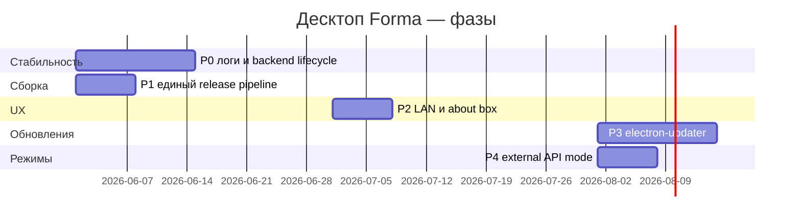

# План улучшения десктопной версии (Forma / Electron)

> **Note (2026-05-30):** Исторический план P0–P5. Текущий UI: [DESKTOP_UI.md](./DESKTOP_UI.md). Backlog: [ROADMAP.md](./ROADMAP.md).

Документ описывает путь от текущего состояния («запустилось, но хрупко») до **стабильного** десктоп-клиента для личного использования без обязательного dev-окружения.

**Текущий стек:** Electron 37 + React (Vite build) + встроенный `backend.exe` (PyInstaller, FastAPI). Данные: `%APPDATA%\Forma\` (`FORMA_DATA_DIR`). Порт API по умолчанию: **8002**.

---

## Текущее состояние (baseline)

| Область | Статус |
|---------|--------|
| Сборка NSIS | ✅ `npm run desktop:dist`, выход `frontend/releaseNN/` |
| Встроенный backend | ✅ `backend.exe`, health-check, retry при занятом порту |
| Логи | ✅ `{FORMA_DATA_DIR}/logs/api.log` |
| Кастомный title bar | ✅ Без системного chrome |
| Локальный вход | ✅ Admin без облака (опционально) |
| LAN-сервер | ✅ Браузер: `start.ps1 -DesktopLan`; **мобилка:** «API для телефона» / `start.ps1 -MobileLan` |
| Схема БД в AppData | ⚠️ Legacy repair при старте (`repair_shared_schema`, сейчас до **v55**) |
| Автообновление | ❌ |
| Режим «только внешний API» | ❌ Частично (dev: uvicorn отдельно) |

---

## Приоритеты и оценка трудозатрат

Оценка для одного разработчика, знакомого с репозиторием. **S** = 0.5–1 дн., **M** = 2–4 дн., **L** = 1–2 нед.

### P0 — стабильность запуска (критично)

| # | Задача | Описание | Оценка |
|---|--------|----------|--------|
| P0.1 | **Структурированное логирование Electron** | Файл `main.log` в userData: spawn backend, порты, LAN, ошибки IPC | S |
| P0.2 | **Диагностика портов** | Перед spawn: проверка 8002, понятное сообщение «занят другим процессом» + PID | S |
| P0.3 | **Отлов падения backend** | При exit code ≠ 0: диалог с хвостом stderr + кнопки «Перезапустить» / «Открыть лог» | M |
| P0.4 | **Гарантированное завершение backend** | `before-quit`: taskkill backend tree; не оставлять зомби после закрытия | S |
| P0.5 | **Ожидание готовности API** | Увеличить таймаут/ backoff; проверять `/api/health` и ключевые маршруты OpenAPI | S |
| P0.6 | **Схема БД в packaged mode** | Всегда `repair_shared_schema` на старте (v049 и ниже); после смены миграций — пересобрать installer и закрыть Forma перед установкой | S |

### P1 — сборка и релизы

| # | Задача | Описание | Оценка |
|---|--------|----------|--------|
| P1.1 | **Единая команда сборки** | `npm run desktop:release` → clean + web + pyinstaller + NSIS + копия в `release/` с версией | M |
| P1.2 | **Версионирование** | `package.json` version → имя установщика `Forma Setup x.y.z.exe` | S |
| P1.3 | **Очистка артефактов** | Скрипт: `backend_bin`, `dist`, старые `release*` по флагу | S |
| P1.4 | **Стабильные пути ресурсов** | Документировать: `.env` в `resources/`, seed DB, `FORMA_EXTERNAL_START_SCRIPT` | S |
| P1.5 | **Иконка и брендинг** | Проверить `.ico` в electron-builder, ярлыки, имя «Forma» | S |

### P2 — UX десктопа

| # | Задача | Описание | Оценка |
|---|--------|----------|--------|
| P2.1 | **Кастомный заголовок** | Drag region, состояние maximize, горячие клавиши, accessibility | S |
| P2.2 | **Окно «О программе»** | Версия Electron, backend, путь к данным, кнопка «Открыть папку данных» | S |
| P2.3 | **LAN без сюрпризов** | UI: «Запускает только Vite; API — встроенный Forma»; проверка `start.ps1` | S |
| P2.4 | **Трей (опционально)** | Сворачивание в трей, не закрывать backend случайно | M |

### P3 — автообновление

| # | Задача | Описание | Оценка |
|---|--------|----------|--------|
| P3.1 | **electron-updater** | Канал `generic` или GitHub Releases; проверка при старте | M |
| P3.2 | **Подпись кода** | Windows SmartScreen — сертификат (если планируется распространение) | L (орг.) |
| P3.3 | **Миграции при обновлении** | Не перезаписывать `workouts.db` в AppData при апдейте; `ensure_db_schema` + repair до v55 in-place | S |

### P4 — режимы работы

| # | Задача | Описание | Оценка |
|---|--------|----------|--------|
| P4.1 | **Dev: внешний backend** | `FORMA_USE_EXTERNAL_API=1` — Electron не spawn, только UI → `:8000` | M |
| P4.2 | **Dev: только Electron** | `npm run desktop:dev` + отдельный uvicorn | S (документация) |
| P4.3 | **Отключение встроенного сервера** | Настройка в UI или env для power-users | M |

### P5 — качество и тесты

| # | Задача | Описание | Оценка |
|---|--------|----------|--------|
| P5.1 | **Чистая VM / новый пользователь Windows** | Чеклист: установка → первый запуск → food/stretch → LAN | M |
| P5.2 | **Smoke E2E desktop** | Playwright против `file://` или packaged (сложнее) | L |
| P5.3 | **Installer hooks** | NSIS: kill Forma/backend перед установкой (частично есть) | S |

---

## Дорожная карта (рекомендуемый порядок)

Для горизонта **6+ месяцев** без активной разработки достаточно закрыть **P0 + P1.1–P1.4** — это снимает основные риски «не запускается» и «LAN убил backend».

---

## Риски на будущее

| Риск | Митигация |
|------|-----------|
| PyInstaller + тяжёлые зависимости (pandas) | Размер установщика ~200+ MB; периодический audit `backend.spec` |
| SQLite в AppData без бэкапа | Облако Yandex/Google уже в UI; напоминание в «О программе» |
| Два API на 8000/8002 | Документация; `-DesktopLan` не трогает 8002 |
| Polar / FIT только в backend | Десктоп наследует; отдельно не дублировать |

---

## Связанные документы

- [SETUP.md](./SETUP.md) — установка десктопа и dev
- [KNOWN_ISSUES.md](./KNOWN_ISSUES.md) — известные ограничения
- [CHANGELOG.md](./CHANGELOG.md) — история релизов
- [../frontend/electron/main.cjs](../frontend/electron/main.cjs) — точка входа Electron
- [../LAUNCHERS.md](../LAUNCHERS.md) — `start.ps1`, `-DesktopLan`
