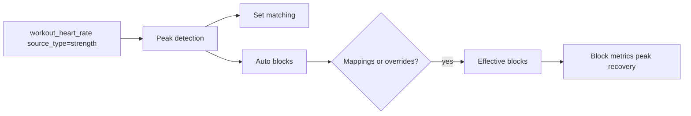

# HR Analytics — пульс в силовых тренировках

Аналитика **пульса по подходам** в силовых тренировках: peak detection, разметка блоков, ручная коррекция и кросс-сессионная сводка.

> **Не путать с кардио-аналитикой:** зоны max HR, TRIMP и zone-time на `/analytics` (#heart-rate) — отдельный pipeline ([ANALYTICS.md](./ANALYTICS.md)). Этот документ — только **strength HR block analysis**.

См. также: [ARCHITECTURE.md](./ARCHITECTURE.md), [API.md](./API.md), [CURRENT_LIMITATIONS.md](./CURRENT_LIMITATIONS.md).

---

## Статус

| Компонент | Статус |
|-----------|--------|
| Per-session analysis (`/hr-analysis`) | **implemented** |
| Anti-oversegmentation + confidence (v2) | **implemented** |
| Manual block editor (v3) | **implemented** |
| Verified mappings + cross-session analytics (v4) | **implemented** |
| Точная физиологическая детекция подходов | **planned** (не цель v1–v4) |

---

## Disclaimer

HR block analysis — **приблизительная аналитика**, а не точное физиологическое определение подходов.

- Пульс с задержкой, шумом и артефактами браслета/груди
- Суперсеты, чередование упражнений и круговые тренировки ломают 1:1 соответствие «блок ↔ подход»
- Алгоритм оптимизирован для **информативности и сравнимости**, не для медицинской точности

---

## Эволюция (v1 → v4)

| Версия | Что реализовано | Ключевые файлы |
|--------|-----------------|----------------|
| **v1** | Peak detection по секундам HR, сопоставление блоков с ordered sets, API `/hr-analysis` | `strength_hr_peak_detection.py`, `strength_hr_analysis_service.py` |
| **v2** | Anti-oversegmentation (merge/split), block + session confidence, superset detection | `strength_hr_peak_detection.py` |
| **v3** | Ручной редактор блоков на графике, `strength_hr_block_overrides` (v51–52) | `StrengthHrBySetPanel.tsx`, `strength_hr_block_override_service.py` |
| **v4** | Persisted mappings (v55), «Подходы верны», `/hr-analytics/*`, sub-tab «Пульс в силовых» | `strength_hr_mapping_service.py`, `strength_hr_analytics_service.py` |

---

## Pipeline (per-session)

1. **HR samples** — `workout_heart_rate` с `source_type='strength'`, привязка через `resolve_session_hr_workout_id()`
2. **Peak detection** — локальные пики и долины → временные блоки
3. **Anti-oversegmentation** — слияние соседних блоков при малой долине; ограничение числа блоков относительно числа рабочих подходов
4. **Set matching** — присвоение `assigned_order_index`, exercise, set_number
5. **Resolution order:** `strength_hr_block_mappings` → legacy `strength_hr_block_overrides` → auto detect
6. **Metrics** — `peak_hr`, `recovery_drop`, `recovery_time` на блок; агрегаты по упражнению и сессии

Debug-объект в ответе `/hr-analysis`: пороги, `oversegmentation_corrected`, merge reasons.

---

## Confidence system

| Уровень | Поведение UI |
|---------|--------------|
| **high** | Авто-метки подходов на графике |
| **medium** | Блоки видны; auto labels требуют ручного подтверждения |
| **low** | Disclaimer; ручная разметка рекомендуется |

Факторы снижения confidence:

- Несовпадение числа блоков и подходов
- **Superset / alternating exercises** → medium, `superset_detected`, без auto mapping
- Warmup blocks — отдельный стиль, не штрафуют mismatch рабочих подходов
- Legacy-сессии без ordered sets → `match_quality: blocks_only`

---

## Manual correction (v3)

UI: [`StrengthHrBySetPanel.tsx`](../frontend/src/components/strength/history/StrengthHrBySetPanel.tsx) в детали силовой на `/workouts`.

| Действие | Эффект |
|----------|--------|
| Сдвиг границ блока (±5/±15 сек) | Live overlay на графике |
| Merge / Split | Пересборка блоков |
| Assign to set | Привязка к ordered set |
| Kind: rest / noise | Серый пунктир, без match |
| Save | PUT overrides → bridge в mappings (v4) |
| «Сбросить к авторазметке» | DELETE overrides/mappings |

---

## Verified mappings (v4)

| `mapping_status` | Значение |
|------------------|----------|
| `auto` | Только авто-детекция |
| `verified` | Пользователь нажал **«Подходы верны»** — snapshot auto blocks |
| `manual` | Ручная геометрия сохранена |

Таблицы (migration v55):

- `strength_hr_session_meta` — статус сессии, `hr_workout_id`
- `strength_hr_block_mappings` — канонические блоки с `verified`, exercise snapshot

---

## Cross-session analytics

**UI:** `/analytics` → Силовая аналитика → sub-tab **«Пульс в силовых»** (`StrengthHrAnalyticsSection.tsx`).

**API:** один запрос вместо трёх:

| Метод | Путь | Назначение |
|-------|------|------------|
| GET | `/api/strength/hr-analytics/overview` | sessions + exercises + trends за один проход |
| GET | `/api/strength/hr-analytics/sessions` | Paginated summaries (wrapper) |
| GET | `/api/strength/hr-analytics/exercises` | Exercise aggregates |
| GET | `/api/strength/hr-analytics/trends` | Time series |
| GET | `/api/strength/hr-analytics/session` | Detail + full analysis |
| POST | `/api/strength/hr-analytics/session/mapping/verify` | «Подходы верны» |
| PUT | `/api/strength/hr-analytics/session/mapping` | Save manual mapping |
| DELETE | `/api/strength/hr-analytics/session/mapping` | Reset to auto |

**Performance:** до **100 HR-сессий** за запрос (`MAX_HR_ANALYTICS_SESSIONS`); флаг `truncated: true` если больше. Lazy-load: fetch только при открытом sub-tab.

Фильтры: `date_from`, `date_to`, `workout_title`, `exercise`, `verified_only`, `min_confidence`.

---

## Per-session API (legacy + detail)

| Метод | Путь |
|-------|------|
| GET | `/api/strength/sessions/{date}/{title}/hr-analysis` |
| GET/PUT/DELETE | `/api/strength/sessions/{date}/{title}/hr-block-overrides` |

Legacy override routes делегируют в mapping service.

---

## Overlays (UI)

- Graph-first: HR line + block boundaries + peak markers
- Warmup — отдельный цвет/стиль
- Edit mode — primary surface для v3 editor
- Session preview в analytics table → link на `/workouts?strengthExpand=...`

---

## Known limitations

| Ограничение | Impact |
|-------------|--------|
| Supersets / чередование | Ambiguous block ↔ set mapping |
| Circuits (`is_circuit`) | Confidence снижается |
| Нет HR на сессии | Empty state, не ошибка |
| Recompute on read | Нет materialized snapshots |
| 100-session cap | Старые сессии обрезаются в overview |

Полный реестр: [CURRENT_LIMITATIONS.md](./CURRENT_LIMITATIONS.md).

---

## Verification guide (manual QA)

Ключевые сценарии (из `backend/tests/STRENGTH_HR_V2_QA.md`):

1. Polar HR + ordered sets — overlays + table
2. No HR — «Нет данных пульса»
3. Legacy без ordered sets — `blocks_only`
4. Superset — medium confidence, no auto mapping
5. Warmups — excluded from mismatch penalty
6. 23 sets — blocks ≤ 23 × 1.3 после v2
7. Small valley inside peak — single block
8. Verify flow — badge Verified persists after reload
9. Manual save → `mapping_status=manual`; reset → auto

---

## См. также

- [ANALYTICS.md](./ANALYTICS.md) — общая страница `/analytics`, lazy sections
- [WORKOUT_PRESETS.md](./WORKOUT_PRESETS.md) — силовые сессии, Polar attach
- [DATABASE.md](./DATABASE.md) — v51–v55 tables
