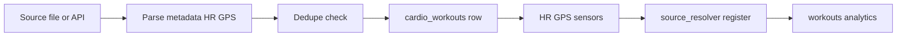
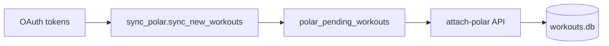

# Import System — универсальный pipeline импорта

Архитектура импорта тренировок и связанных данных: FIT, Polar, ручная загрузка файлов, интеграция с source resolver.

Операционные how-to: [FIT_SYNC.md](./FIT_SYNC.md), [SYNC.md](../SYNC.md).

См. также: [SOURCE_RESOLVER.md](./SOURCE_RESOLVER.md), [ARCHITECTURE.md](./ARCHITECTURE.md).

---

## Статус

| Компонент | Статус |
|-----------|--------|
| FIT folder import | **implemented** |
| Polar AccessLink fetch | **implemented** |
| Polar manual upload (TCX/GPX/FIT) | **implemented** |
| Polar attach to cardio/strength | **implemented** |
| Health Connect ingest | **implemented** (отдельный sync path — [HEALTH_CONNECT.md](./HEALTH_CONNECT.md)) |
| Universal pre-import diff UI | **partial** (только FIT progress polling) |
| Mi / Xiaomi direct import | **planned** (CLI stubs) |

---

## Universal pipeline (conceptual)

**Принцип:** один **canonical workout row** (`cardio_workouts` или силовая сессия) + side tables (`workout_heart_rate`, `gps_tracks`, `workout_sensors`) + **contribution records** в source resolver.

Отдельного data warehouse нет — импорт пишет сразу в рабочие таблицы SQLite.

---

## FIT import

| Аспект | Детали |
|--------|--------|
| Parser | `fitdecode` в [`fit_importer.py`](../fit_importer.py) |
| Dedupe | Таблица `imported_files` по имени файла + source `fit_coospo` |
| Repair | Файл помечен imported, но workout отсутствует → re-import |
| Reimport | `--reimport` / API `reimport: true` — удаление старой строки, повторный parse |
| Background | `POST /api/sync/fit` → `fit_importer_service` (in-memory task, polling status) |
| Sync mode | `?sync=true` — blocking import (debug) |

**Запись:**

- `cardio_workouts` (type bike/run/…)
- `workout_heart_rate`, `workout_sensors`, `gps_tracks`
- `bike_power_service.apply_power_from_import`
- `source_resolver_service.register_fit_import()`

**Cleanup:** `cleanup_stale_fit_bike_duplicates()` после batch.

**Не поддерживается:** GPX/TCX как primary import path (только через Polar upload → pending).

---

## Polar AccessLink

| Шаг | API / модуль |
|-----|--------------|
| OAuth | `GET /api/polar/auth`, callback |
| Fetch | `POST /api/sync/polar/fetch`, `POST /api/sync/integrations` |
| Pending queue | `GET/DELETE /api/polar/pending/*` |
| Attach cardio | `POST /api/cardio/{id}/attach-polar` — fill-empty scalars |
| Attach strength | `POST /api/strength/{id}/attach-polar` — overwrite session scalars |
| Auto attach | Frontend `usePolarAutoAttach` — 1:1 date match |

После attach: `register_polar_attach()` в source resolver, `polar_pending_workouts.imported=1`.

---

## Manual file upload (TCX / GPX / FIT)

| Аспект | Детали |
|--------|--------|
| Entry | Settings → **Синхронизация** → Polar upload |
| Service | `polar_upload_service.py` |
| Result | Запись в `polar_pending_workouts`, **не** прямой insert в cardio |
| Dedupe | `_assert_not_duplicate()` по parsed metadata |
| Next step | Manual или auto attach к существующей тренировке |

---

## Dedupe strategies

| Source | Mechanism |
|--------|-----------|
| FIT | `imported_files` filename; future date skip |
| Polar upload | Duplicate assert in pending queue |
| Polar attach | One pending → one workout |
| HC cardio | `should_block_hc_write()` если FIT/Polar/manual/Excel уже владеет date+type |
| Linked workouts | `workout_source_links`, `is_linked_duplicate()` |

---

## Canonical workout model

**Cardio:** одна строка `cardio_workouts` на активность; `data_source` legacy + contributions в resolver.

**Strength:** many rows `strength_workouts` (sets); HR через `workout_heart_rate` с `source_type=strength`.

**Contributions:** `workout_source_contributions` — per metric (HR, GPS, calories, duration, distance, sensors, metadata).

---

## Import preview

| Source | Preview |
|--------|---------|
| FIT | **partial** — progress bar + stats (`useFitImport` polling `GET /api/sync/fit/status/{task_id}`) |
| Polar pending | List in UI before attach |
| HC | Hub shows date ranges, not per-field diff |
| Full diff before write | **planned** |

---

## Source priority

User prefs: `user_profile.source_priority_prefs` — ordered source lists per metric.

Effective value: `source_resolver_service.resolve_workout_view()`.

Подробнее: [SOURCE_RESOLVER.md](./SOURCE_RESOLVER.md).

---

## UI entry points

| Surface | Location |
|---------|----------|
| FIT folder + sync | Settings → **Данные и импорт** (`?tab=data`) or **Синхронизация** (`?tab=sync`) |
| Polar sync/upload | Same tab |
| Combined sync | `POST /api/sync/integrations` (FIT then Polar) |
| Import diagnostics | Developer Tools → `ImportDiagnosticsPanel` (**experimental**) |
| CLI | `fit_importer.py`, `sync_polar.py`, `sync_all.py` |

> Старые tab id: `sync_cloud` → `sync`, `integrations` → `connections`. См. [SETTINGS.md](./SETTINGS.md).

---

## Integration sync orchestration

[`integration_sync_service.py`](../backend/services/integration_sync_service.py):

1. FIT import (background or sync)
2. Polar fetch
3. Sequential, not parallel (single-threaded backend)

---

## См. также

- [FIT_SYNC.md](./FIT_SYNC.md) — пользовательский guide FIT
- [BIKE.md](./BIKE.md) — power estimation после FIT
- [WORKOUT_PRESETS.md](./WORKOUT_PRESETS.md) — Polar на `/workouts`
- [DEVELOPER_TOOLS.md](./DEVELOPER_TOOLS.md) — import diagnostics
