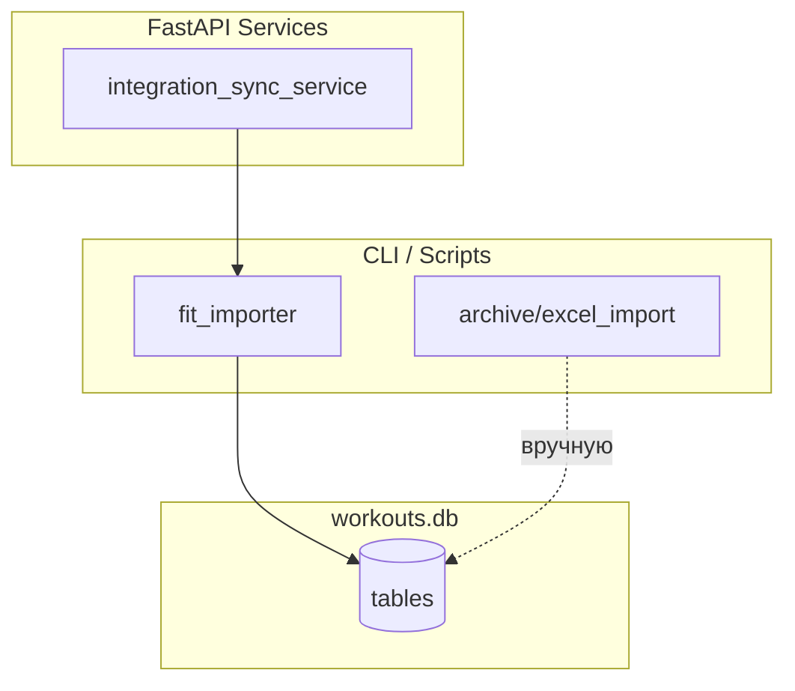

# SERVICES.md

Описание сервисов, import-модулей и утилит **MyHealthDashboard**.

---

## Backend services (`backend/services/`)

### `food_service.py`

| | |
|--|--|
| **Назначение** | Дневник питания: продукты, записи, нормы, расход (BMR), шаблоны, рационы |
| **Вход** | date, phase, product_id, template_id, plan_id, payloads из API |
| **Выход** | dict / list для Pydantic (`FoodDayResponse`, `FoodWeekResponse`, …) |
| **Зависимости** | `backend.database.get_db`, `import_products.sync_products`, `user_service`, `utils/hr_profile` |

Ключевые функции:
- `get_day_log`, `get_week_log` — дневник и неделя (+ fiber, per-kg insights)
- `create_product`, `create_composite_product` — простые и составные продукты (в т.ч. поля микронутриентов на 100 г)
- `scale_macros`, `_macros_from_components`, `_component_quantity`
- `_ENTRY_SELECT`, `_entry_from_row` — live JOIN `shared.food_products` + snapshot fallback для БЖУ/ккал; клетчатка из live `fiber_g`
- `clear_day_entries` — DELETE по `date`, `phase`, `user_id`; возвращает count
- `apply_template`, `apply_meal_plan`, `apply_meal_plan_week`, `apply_meal_plan_range`
- `_meal_plan_day_offset` — индекс дня (0…6) для недельного рациона
- `get_weekly_meal_schedule`, `save_weekly_meal_schedule`
- `compute_bmr` — с учётом `sex` из профиля

---

### `nutrition_service.py` / `nutrition_balance_service.py`

| | |
|--|--|
| **Назначение** | Прогноз сушки/набора, зоны дефицита, готовность данных, недельный баланс |
| **Вход** | phase, targets, balance_period, max_deficit |
| **Выход** | forecast dict, `deficit_status`, `forecast-readiness` |
| **Зависимости** | `food_service`, `user_profile`, `week_calendar` |

Ключевые функции:
- `calculate_dynamic_cut_forecast`, `build_dynamic_cut_forecast_response` — динамический прогноз; danger → capped projection (HTTP 200)
- `assess_deficit_zone` — safe / warning / danger
- `get_forecast_readiness` — скан до 8 недель, 2 filled weeks × ≥3 intake days
- `get_week_energy_balance`, `get_cut_deficit_control`

---

### `health_connect_sync_service.py` / `health_connect_debug_service.py`

| | |
|--|--|
| **Назначение** | Ingest batch с Android; debug payload для UI |
| **Вход** | HC JSON payload |
| **Выход** | saved counts, `health_connect_sync_log` row |
| **Зависимости** | `health_connect_mapping.py`, body/cardio/sleep services |

API: `POST /api/sync/health-connect`, `GET /api/sync/health-connect/debug`, `GET /api/sync/health-connect/hub`. См. [HEALTH_CONNECT.md](./HEALTH_CONNECT.md).

---

### `source_resolver_service.py`

| | |
|--|--|
| **Назначение** | Unified source per metric; HC write block; conflicts |
| **Таблицы** | `workout_source_contributions`, `workout_source_links` (v54) |
| **API** | `GET /api/cardio/{id}/sources`, `GET/PUT /api/user/source-priorities` |

См. [SOURCE_RESOLVER.md](./SOURCE_RESOLVER.md).

---

### `health_connect_hub_service.py`

Hub aggregate for `/health-connect` production UI.

---

### Strength HR services

| Module | Role |
|--------|------|
| `strength_hr_peak_detection.py` | Peak detection, anti-oversegmentation |
| `strength_hr_analysis_service.py` | Per-session `/hr-analysis` |
| `strength_hr_block_override_service.py` | Legacy overrides (v51) |
| `strength_hr_mapping_service.py` | Verified/manual mappings (v55) |
| `strength_hr_analytics_service.py` | Cross-session `/hr-analytics/*` |

См. [HR_ANALYTICS.md](./HR_ANALYTICS.md).

---

### `strength_service.py`

| | |
|--|--|
| **Назначение** | CRUD силовых, сессии, прогресс; `duration_sec` и avg_hr из HR Polar |
| **Вход** | date, workout_title, exercise payloads |
| **Выход** | sessions (+ duration_sec), rows, progress |
| **Зависимости** | SQLite, `cardio_service.hr_stats_for_workout` |

---

### `cardio_service.py`

| | |
|--|--|
| **Назначение** | Кардио CRUD, HR/GPS, TRIMP, zone-time, enrichment ккал/пульса |
| **Вход** | workout_id, date range, type filters, `interval_sec` |
| **Выход** | workouts (с enrich Polar/FIT), HR series, GeoJSON, sensors/points |
| **Зависимости** | `utils/bike_track`, `database/db_utils`, `hr_stats_for_workout` |

Ключевые функции:

- `get_workouts` — список + `enrich_cardio_from_device`, `enrich_bike_workout`
- `hr_stats_for_workout` — avg/max HR и duration из `workout_heart_rate`
- `get_gps`, `get_sensors`, `get_points` — карта и графики вело
- `_is_device_sourced_cardio` — FIT/Polar и HR samples

---

### `polar_attach_service.py`

| | |
|--|--|
| **Назначение** | Очередь `polar_pending_workouts`, attach к cardio/strength |
| **Вход** | `polar_transaction_id`, workout id |
| **Выход** | HR samples count, gps_saved, fields_updated |
| **Зависимости** | `import_polar_historical`, `polar_file_parser`, `upsert_gps_track` |

Ключевые функции:

- `attach_polar_to_cardio` — HR, GPS, scalar enrich; **fill-empty-only** (`avg_hr`, `max_hr`, `calories_chest`, `calories`, `duration_sec`)
- `attach_polar_to_strength` — HR samples + **overwrite** session-wide `avg_hr`, `calories_chest` на всех строках сессии, если Polar вернул значения
- `_apply_polar_to_strength_session` / `_update_cardio_scalars_if_empty` — разная семантика перезаписи
- `list_pending_workouts`, `delete_manual_pending_workout` (только `upload:*`)
- `extract_hr_samples` — AccessLink, upload pairs, TCX/GPX/FIT raw

---

### `polar_upload_service.py` / `sync_polar` (API wrappers)

| | |
|--|--|
| **Назначение** | `POST /api/sync/polar/fetch`, `/polar/upload` |
| **Выход** | pending rows, parse stats |
| **Зависимости** | `sync_polar.py`, `polar_file_parser.py` |

---

### `body_service.py`

| | |
|--|--|
| **Назначение** | Замеры тела, недельные средние, sync → `daily_weight` |
| **Вход** | date, metric fields |
| **Выход** | BodyMetric records |
| **Зависимости** | `utils.body_metrics`, `db_utils.save_daily_weight` |

---

### `exercise_service.py`

| | |
|--|--|
| **Назначение** | Типы тренировок (активные пресеты), prefill формы, редактор наборов `exercise_sets` |
| **Вход** | workout_type / workout_title, date, set_id |
| **Выход** | exercise sets, editor state, prefill с `preset_id` и дефолтами |
| **Зависимости** | `workout_presets`, `preset_exercises`, `exercise_sets`, `utils/helpers` |

---

### `preset_service.py`

| | |
|--|--|
| **Назначение** | CRUD пресетов, архивация/восстановление, удаление без истории |
| **Вход** | name, exercises[], preset_id |
| **Выход** | preset dict + `workout_count` |
| **Зависимости** | `workout_presets`, `preset_exercises`, `strength_workouts` |

Ключевые функции:
- `list_presets`, `list_active_preset_names`
- `get_preset_by_id`, `get_preset_by_name`, `get_preset_id_by_name`
- `create_preset`, `update_preset`, `archive_preset`, `restore_preset`, `delete_preset`

---

### `analytics_service.py`

| | |
|--|--|
| **Назначение** | Калории по дням, CTL/ATL/TSB из TRIMP |
| **Вход** | from, to, days |
| **Выход** | time series для графиков |
| **Зависимости** | cardio TRIMP, strength calories columns |

---

### `user_service.py`

| | |
|--|--|
| **Назначение** | Профиль, нормы питания, интеграции, аналитика силовых, расчёт уровня активности |
| **Вход** | UserProfileUpdate, NutritionSettingsSave |
| **Выход** | UserProfile, NutritionSettings, LevelCalculationResponse |
| **Зависимости** | `user_profile`, `settings_service`, `backend/core/bmr.py`, TRIMP/strength volume |

Ключевые функции:
- `get_nutrition_settings`, `save_nutrition_settings`
- `get_default_nutrition_grams_per_kg`, `get_effective_nutrition_grams_per_kg`
- `calculate_user_level` — Mifflin-St Jeor + TDEE + рекомендации БЖУ

---

### `steps_service.py`

| | |
|--|--|
| **Назначение** | Чтение `steps_history`, yearly totals |
| **Вход** | from, to dates |
| **Выход** | StepsHistoryResponse |
| **Зависимости** | SQLite |

---

### `stretching_service.py`

| | |
|--|--|
| **Назначение** | CRUD упражнений и пресетов растяжки, журнал, календарь активности, импорт/перевод |
| **Вход** | exercise/preset payloads, date ranges |
| **Выход** | exercises, presets, log entries, activity days |
| **Зависимости** | `stretching_*` tables, MyMemory API (CLI translate) |

Ключевые функции:
- `list_exercises`, `create_exercise`
- `list_presets`, `create_preset`, `archive_preset`, `create_log_entry`
- `get_activity_calendar`, `translate_exercises_in_db`, `translate_descriptions_in_db`

---

### `bike_settings_service.py`

| | |
|--|--|
| **Назначение** | Настройки велосипеда, Crr, масса системы |
| **Вход** | BikeSettingsSave payload |
| **Выход** | `bike_settings` dict с effective Crr и rider weight |
| **Зависимости** | `bike_settings`, `tire_coefficients`, `surface_multipliers`, body weight |

---

### `bike_power_service.py`

| | |
|--|--|
| **Назначение** | Реальная и оценочная мощность велотренировок |
| **Вход** | `cardio_workout_id`, FIT import (`by_second`), sensor rows |
| **Выход** | `avg_power_watts`, `estimated_avg_power_watts`, `power_source` |
| **Зависимости** | `bike_settings_service`, `settings_service`, `utils/power_estimation.py`, `body_metrics` / `user_profile` |

Ключевые функции:

- `apply_power_from_import` — после FIT: real из metadata/слотов или оценка
- `_save_real_power_from_sensor_rows` — если в `workout_sensors` есть `power_watts > 0`
- `_get_rider_cda(conn, settings)` — CdA (м²) из веса + роста + Cd по покрышке/полу; `None` → basic
- `_try_save_estimated_power` — advanced (`estimated_advanced`) или basic (`estimated_basic`)
- `estimate_workout_power`, `backfill_missing_bike_power`, `get_workout_power`

`power_source`: `real` | `estimated_advanced` | `estimated_basic` | `estimated` (legacy).

---

### `micro_nutrients_service.py`

| | |
|--|--|
| **Назначение** | Недельная/дневная сводка микронутриентов, цели |
| **Вход** | date, phase |
| **Выход** | `MicrosWeekResponse`, `MicrosDayResponse`, goals dict |
| **Зависимости** | `food_entries`, `food_products`, `user_profile.micro_goals_json`, `utils/micro_nutrients` |

---

### `settings_service.py`

| | |
|--|--|
| **Назначение** | Общие настройки из `user_profile`: пол, начало недели, облако, UI, **`units_system`** |
| **Вход** | partial settings payload |
| **Выход** | merged settings dict |
| **Зависимости** | `user_service`, `backend/core/week_calendar.py` |

---

### `backend/utils/american_units.py`

| | |
|--|--|
| **Назначение** | Конвертация метрики в пародийные единицы (только для отображения/отчётов) |
| **Вход** | кг, км, м, ккал, см, °C, Вт, г |
| **Выход** | числа и строки (`format_distance_km`, `kg_to_american_weight`, …) |
| **Зеркало** | `frontend/src/utils/americanUnits.ts` |

Справочник формул: [UNITS_CONVERSION.md](./UNITS_CONVERSION.md).

---

### `_sql_helpers.py`

| | |
|--|--|
| **Назначение** | DataFrame → records, coercion int/float |
| **Зависимости** | pandas (optional) |

---

## Ingestion / import modules (корень проекта)

### `fit_importer.py`

| | |
|--|--|
| **Назначение** | Парсинг FIT (Coospo Ride) → cardio + HR + GPS (все фиксации) |
| **Вход** | папка FIT (default `E:\fit activity`) |
| **Выход** | `cardio_workouts`, `workout_sensors`, `workout_heart_rate`, `gps_tracks`, `imported_files` |
| **Зависимости** | fitdecode, `db_common`, `utils/bike_track`, `utils/fit_coords` |

`gps_samples[]` — все GPS-точки из FIT record; `track_points` предпочитает их перед 1 Гц fallback.

После импорта: `bike_power_service` может рассчитать `estimated_avg_power_watts`.

---

### `scripts/import_free_exercise_db.py`

| | |
|--|--|
| **Назначение** | CLI-импорт упражнений растяжки из архива Free Exercise DB |
| **Вход** | ZIP free-exercise-db (скачивание или локальный путь) |
| **Выход** | `shared.stretching_exercises` |
| **Зависимости** | `stretching_service`, фильтр по ключевым словам растяжки |

---

### `translate_stretching_exercises.py`

| | |
|--|--|
| **Назначение** | Идемпотентный перевод названий/описаний (MyMemory en→ru) |
| **Вход** | `--names-only`, `--descriptions-only`, `--delay` |
| **Выход** | UPDATE `stretching_exercises.translated` / `description_translated` |
| **Зависимости** | `stretching_service.translate_*_in_db` |

---

## Sync scripts

| Скрипт | Статус | Назначение |
|--------|--------|------------|
| `fit_importer.py` | ✅ | FIT → cardio + HR + GPS |
| `sync_polar.py` | ✅ | Polar AccessLink fetch |
| `import_polar_historical.py` | ✅ | Bulk historical Polar import |
| `sync_mi_fitness.py` | ⚠️ Заглушка | Mi Fitness |
| `sync_xiaomi_home.py` | ⚠️ Заглушка | Xiaomi Home |
| `sync_all.py` | CLI | Все sync подряд |
| `backup_to_excel.py` | ✅ | Экспорт БД → Excel |

Общий модуль: **`db_common.py`**. Подробнее: [../SYNC.md](../SYNC.md).

---

## Database layer (`database/`)

### `migrations.py`

| | |
|--|--|
| **Назначение** | DDL, ALTER, seed exercise sets |
| **Выход** | актуальная схема `workouts.db` |

### `db_utils.py`

| | |
|--|--|
| **Назначение** | Data loaders, CRUD workouts/body/weight, FIT reconciliation, nutrition forecasts, `repair_shared_schema` |
| **Кэш** | Нет in-process кэша — каждый запрос читает SQLite напрямую |

**`repair_shared_schema`:** idempotent-починка legacy `shared.db` при каждом подключении (packaged Forma); включает миграции v046/v047 (drop FK на `food_products` в `meal_plan_items` / `food_entries`).

---

## Utility modules (`utils/`)

| Модуль | Назначение | Вход → Выход |
|--------|------------|--------------|
| `constants.py` | Константы UI, порядок упражнений, body fields | — |
| `helpers.py` | Таблицы тренировок, метрики сессий | rows → display |
| `hr_profile.py` | Max HR, зоны, Edwards TRIMP | HR samples → TRIMP, zones |
| `date_guard.py` | Запрет будущих дат (тренировки); food использует `_normalize_food_date` без этого ограничения | date string → validation |
| `date_utils.py` | Форматирование дат Excel | cell → ISO date |
| `math_utils.py` | reps parsing, pace/speed | raw → computed |
| `cardio_dataframe.py` | Нормализация колонок cardio DF | DataFrame → DataFrame |
| `fit_coords.py` | semicircles → WGS84 | FIT coords → lat/lon |
| `power_estimation.py` | Мощность: Crr + уклон; опционально CdA (аэродинамика) | speed, slope, mass, crr, cda → W |
| `micro_nutrients.py` | Ключи и дефолтные нормы 9 микронутриентов | — |

---

## Analytics modules (логика)

| Область | Где реализовано |
|---------|-----------------|
| **TRIMP / зоны** | `utils/hr_profile.py`, `cardio_service.py` |
| **CTL/ATL/TSB** | `analytics_service.py` |
| **1ПМ Epley** | `strength_workouts.epley_1rm`, migrations backfill |
| **Калории дня** | `analytics_service.py` (strength + cardio) |
| **BMR / баланс** | `food_service.compute_bmr`, `get_expenditure` |
| **Cut/bulk forecast** | `database/db_utils.compute_cut_forecast`, nutrition router |

---

## Bike modules

| Компонент | Роль |
|-----------|------|
| `fit_importer.py` | Импорт FIT → sensors, HR, enriched GeoJSON |
| `bike_power_service.py` | Реальная и оценочная мощность (advanced/basic, CdA) |
| `bike_settings_service.py` | Crr, масса, настройки велосипеда |
| `utils/bike_track.py` | GeoJSON properties, `build_enriched_geojson`, haversine speed |
| `utils/sensor_downsample.py` | Прореживание 1 Гц / N сек, температура |
| `cardio_service.enrich_bike_workout` | Подстановка ккал/HR из сводных строк в БД |
| `frontend/src/utils/bikeTrack.ts` | Percentile-раскраска, все рёбра маршрута, merge сегментов |
| `BikeGpsMap.tsx` | Canvas renderer, легенда p10–p90, hover, popup |
| `BikeWorkoutCharts.tsx` | Plotly-графики датчиков |
| `CardioDataIntervalSelect.tsx` | Выбор downsample (все / 1 Гц / N с) |

---

## Calorie / food modules

| Комponent | Роль |
|-----------|------|
| `food_service.scale_macros` | БЖУ на порцию из per-100g |
| `food_service.create_composite_product` | POST `/food/composite` |
| `user_service.get_effective_nutrition_grams_per_kg` | Панель г/кг в дневнике |
| `CompositeProductModal.tsx` | UI создания блюда |
| `NutritionSettings.tsx` | Нормы в `/settings` |

---

## Frontend services (`frontend/src/api/`)

Axios-обёртки — тонкие клиенты без бизнес-логики. Кэш и retry — TanStack Query (`queryKeys.ts`).

| Module | Backend |
|--------|---------|
| `food.ts` | `/food/*` |
| `sync.ts` | `/sync/*` |
| `stretching.ts` | `/stretching/*` |
| `strength.ts` | `/strength/*` |
| … | … |

---

## Диаграмма зависимостей import → API

---

## См. также

- [UNITS_CONVERSION.md](./UNITS_CONVERSION.md) — конвертация единиц отображения
