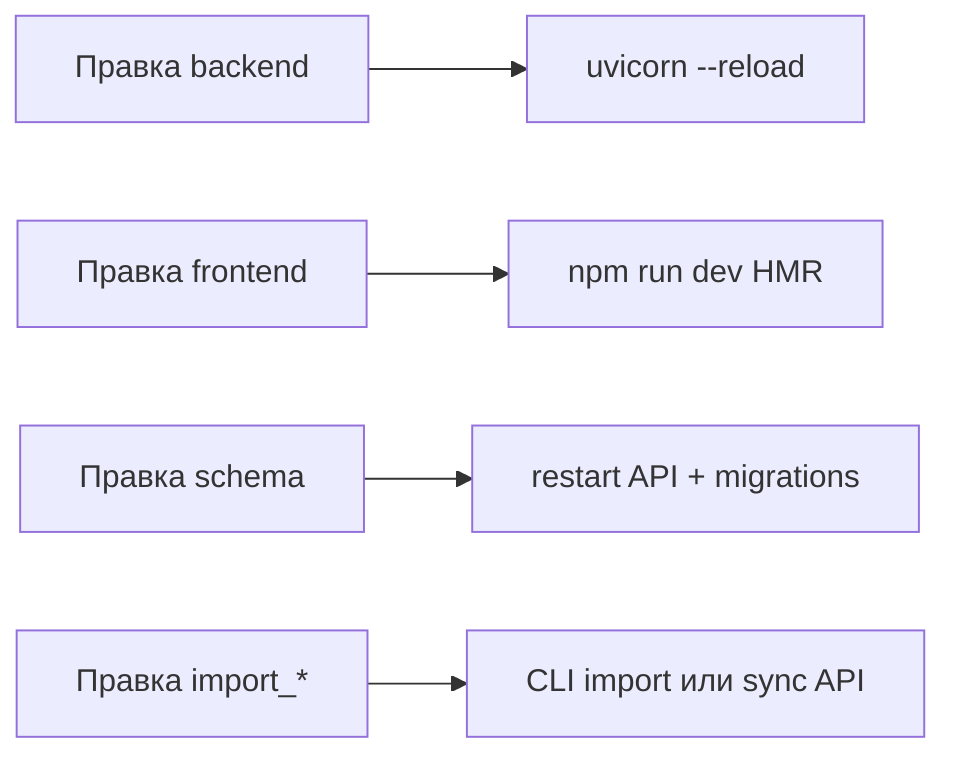

# SETUP.md

Установка и запуск **MyHealthDashboard** на Windows.

---

## Требования

| Компонент | Версия |
|-----------|--------|
| Windows | 10/11 |
| Python | 3.12 (рекомендуется) |
| Node.js | 18+ (для frontend) |
| Git | опционально |

---

## Быстрый старт

```powershell
cd C:\Users\brett\Desktop\MyHealthDashboard

# 1. Python venv
py -3.12 -m venv venv
.\venv\Scripts\pip install -r backend\requirements.txt

# 2. Frontend deps
cd frontend
npm install
cd ..

# 3. Запуск (API + React)
.\start.ps1
```

Откроется браузер: **http://127.0.0.1:5173**

Альтернатива: двойной клик **`start.vbs`** или **`start.bat`**.

---

## Десктопное приложение Forma (Electron)

Установщик собирается из `frontend/` (PyInstaller + electron-builder).

### Сборка установщика

```powershell
cd C:\Users\brett\Desktop\MyHealthDashboard\frontend
npm install
npm run desktop:dist -- --config.directories.output=release33
```

Результат: `frontend\release33\Forma Setup 1.0.0.exe` (номер папки `releaseNN` — по желанию).

| Скрипт | Описание |
|--------|----------|
| `npm run desktop:dev` | Electron + UI; backend — отдельно (uvicorn) или встроенный при `desktop:build:all` |
| `npm run desktop:build:all` | Vite production + `backend.exe` |
| `npm run desktop:dist` | NSIS-установщик в `frontend/release/` (или `--config.directories.output=…`) |

### Установка и данные

1. Закройте старый Forma (`Forma.exe`, `backend.exe` в диспетчере задач).
2. Запустите установщик из `releaseNN\`.
3. Данные приложения: **`%APPDATA%\Forma\`** (`FORMA_DATA_DIR`):
   - `workouts.db`, `shared.db`
   - `logs\api.log`
4. Вход: локальный admin (без облака) или OAuth — см. настройки.

### Порты

| Режим | API | UI |
|-------|-----|-----|
| **Forma (packaged)** | `127.0.0.1:18002` (встроенный `backend.exe`, см. `forma-desktop-api.json`) | Окно Electron (статика из asar) |
| **Dev `start.ps1`** | `8000` или `8002` | `http://127.0.0.1:5173` |

### LAN с телефона при открытой Forma

В **Настройки → Синхронизация** — «Запустить LAN-сервер». Запускается `start.ps1` с флагом **`-DesktopLan`** (не перезапускает встроенный API на 8002, поднимает Vite на 5173).

Альтернатива вручную:

```powershell
cd C:\Users\brett\Desktop\MyHealthDashboard
.\start.ps1 -DesktopLan
```

Переменная **`FORMA_EXTERNAL_START_SCRIPT`** — полный путь к `start.ps1`, если проект не в стандартных папках.

План доработок десктопа: [DESKTOP_IMPROVEMENTS.md](./DESKTOP_IMPROVEMENTS.md).

---

## Документация Word (`.docx`)

Markdown-исходники — в папке `docs/`. Готовые файлы Word — в **`docs/docx/`**.

Перегенерация после изменений в `.md`:

```powershell
.\venv\Scripts\python.exe scripts\generate_docx_docs.py
```

Скрипт при необходимости установит `python-docx`. Подробнее: [docs/README.md](./README.md), [docs/docx/README.md](./docx/README.md).

---

## Лаунчер `start.ps1`

| Параметр | Описание |
|----------|----------|
| (без параметров) | API `:8000` (или `:8002` при занятом 8000) + Vite `:5173` |
| `-Install` | `npm install` при необходимости |
| `-NoBrowser` | Не открывать браузер |
| `-Stop` | Остановить процессы на портах |
| `-NoRestart` | Не перезапускать уже занятые порты |
| `-DesktopLan` | Режим для Forma: только Vite, API на 8002 не трогать |
| `-OpenFirewall` | Правила брандмауэра для LAN (5173, API) |

Примеры:

```powershell
.\start.ps1 -Stop
.\start.ps1 -Install -NoBrowser
```

Подробнее: [LAUNCHERS.md](../LAUNCHERS.md)

---

## Доступ с телефона / другого ПК в локальной сети

1. ПК и телефон в **одной Wi‑Fi** (не гостевая сеть с изоляцией клиентов).
2. Запустите `.\start.ps1` — в конце будет строка **`Dashboard (LAN/Wi-Fi): http://192.168.x.x:5173`**.
3. На телефоне откройте **именно этот адрес**, не `127.0.0.1` и не `localhost`.
4. Если страница не открывается — разрешите порты в брандмауэре Windows (от администратора):

```powershell
.\scripts\open_lan_firewall.ps1
# или при старте:
.\start.ps1 -OpenFirewall
```

Vite слушает все интерфейсы (`0.0.0.0:5173`); запросы `/api` проксируются на API на этом же ПК. API по умолчанию только на `127.0.0.1` — для LAN это нормально, если заходите через порт **5173**.

**Tailscale:** если установлен, в выводе `start.ps1` будет адрес вида `100.x.x.x:5173`.

### Мобильное приложение (Android)

Телефон **не** ходит через Vite-прокси — только **порт API** (8000/8002).

1. **Forma (установщик):** Настройки → Синхронизация → **«Включить API для телефона»**.
2. **Разработка:** `.\start.ps1 -MobileLan` — в выводе строки **Mobile API (LAN/Wi‑Fi)**.
3. На телефоне: приложение Forma → адрес API → **«Войти как admin»** (или задайте URL в Настройках → Подключение к ПК).

Дефолт URL можно вшить в `mobile/.env` (`EXPO_PUBLIC_API_BASE_URL`); смена IP в Wi‑Fi — **без пересборки APK**, через настройки приложения.

Проверка: в браузере телефона `http://IP:ПОРТ/api/health` → `ok`. Брандмауэр: `.\start.ps1 -OpenFirewall` или `.\scripts\open_lan_firewall.ps1 -ApiOnly -ApiPort 8002`.

Подробно: [MOBILE.md](./MOBILE.md).

### Зомби-процесс на порту 8000

Если API на `:8000` отвечает, но в Swagger **нет** маршрутов `/api/nutrition/cut/deficit-control` и `/api/nutrition/forecast/dynamic`, это **старая** копия backend. `start.ps1` переключится на **8002** и обновит `.api-port` + `frontend/.env.local`. Полный перезапуск: `.\start.ps1 -Stop`, затем `.\start.ps1`.

---

## Ручной запуск (dev)

### Backend

```powershell
cd C:\Users\brett\Desktop\MyHealthDashboard
.\venv\Scripts\python.exe -m uvicorn backend.main:app --reload `
  --reload-dir backend --reload-dir database --reload-dir utils --reload-dir . `
  --host 127.0.0.1 --port 8000
```

Проверка: http://127.0.0.1:8000/api/health  
Swagger: http://127.0.0.1:8000/docs

### Frontend

```powershell
cd C:\Users\brett\Desktop\MyHealthDashboard\frontend
npm run dev
```

URL: http://127.0.0.1:5173

---

## Зависимости

### Python — API (`backend/requirements.txt`)

```
fastapi>=0.110.0
uvicorn[standard]>=0.27.0
pandas>=2.0.0
pydantic>=2.0.0
requests>=2.31.0
```

### Python — полный стек (`requirements.txt`, root)

Импорт Excel/FIT и синхронизация: `openpyxl`, `fitdecode`, `pandas`, `gspread`, …

Для FIT-импорта и Excel:

```powershell
.\venv\Scripts\pip install -r requirements.txt
```

### Frontend (`frontend/package.json`)

- React 18, Vite 6, TypeScript
- TanStack Query, Axios, React Router
- Plotly, Leaflet, Recharts, react-activity-calendar, Tailwind CSS

```powershell
cd frontend
npm install
npm run build    # production build → frontend/dist
```

---

## Переменные окружения

| Файл | Переменная | Значение | Описание |
|------|------------|----------|----------|
| `frontend/.env` | `VITE_API_URL` | `/api` | Base URL API (через Vite proxy) |
| `frontend/.env.local` | `VITE_API_PORT` | `8000` | Порт backend (генерируется `start.ps1`) |
| `.api-port` | — | `8000` | Текущий порт API (корень проекта) |
| (системная) | `STEPS_HISTORY_XLSX` | путь к xlsx | Override для `import_steps_history` |
| Electron | `FORMA_DATA_DIR` | `%APPDATA%\Forma` | БД и логи packaged-приложения |
| Electron | `FORMA_EXTERNAL_START_SCRIPT` | путь к `start.ps1` | LAN-кнопка в десктопе |
| Electron | `VITE_API_PORT` / `PORT` | `8002` | Порт встроенного backend |
| `mobile/.env` | `EXPO_PUBLIC_API_BASE_URL` | `http://192.168.x.x:8002/api` | Android → LAN API |

Корневой **`.env`** — Polar, OAuth, облако (копируется в `resources/.env` при сборке Forma).

---

## OAuth Yandex / Google

Redirect URI должен **совпадать побайтно** с тем, что зарегистрировано в консоли провайдера и тем, что показывает **Настройки → Синхронизация → OAuth — redirect URI** (или `GET /api/cloud/oauth-debug`).

| Режим | Yandex callback | Google callback |
|-------|-----------------|-----------------|
| Dev (`start.ps1`, API :8000) | `http://127.0.0.1:8000/api/cloud/callback/yandex` | `http://127.0.0.1:8000/api/cloud/callback/google` |
| Forma (packaged, API :8002) | `http://127.0.0.1:8002/api/cloud/callback/yandex` | `http://127.0.0.1:8002/api/cloud/callback/google` |
| Tailscale / LAN mobile | `http://100.x.x.x:8002/api/cloud/callback/yandex` | `http://100.x.x.x:8002/api/cloud/callback/google` |

**Приоритет redirect URI в backend:**
1. `YANDEX_REDIRECT_URI` / `GOOGLE_REDIRECT_URI` в `.env`
2. `PUBLIC_API_BASE_URL` + `/api/cloud/callback/{provider}`
3. `redirect_base` из запроса или `request.base_url`

**Важно:**
- `127.0.0.1` и `localhost` — **разные** URI для OAuth
- Google OAuth в режиме **Testing** — добавьте свой email в Test users
- Для Forma задайте в `.env` порт **8002** или `PUBLIC_API_BASE_URL=http://127.0.0.1:8002`

Переменные `.env`:

```env
YANDEX_CLIENT_ID=...
YANDEX_CLIENT_SECRET=...
YANDEX_REDIRECT_URI=http://127.0.0.1:8002/api/cloud/callback/yandex

GOOGLE_CLIENT_ID=...
GOOGLE_CLIENT_SECRET=...
GOOGLE_REDIRECT_URI=http://127.0.0.1:8002/api/cloud/callback/google
```

---

Пример `frontend/.env`:

```env
VITE_API_URL=/api
```

---

## Vite proxy и порт API

`start.ps1` выбирает порт API (**8000** или **8002**, если 8000 занят), записывает его в **`.api-port`** в корне и обновляет **`frontend/.env.local`** (`VITE_API_PORT=…`). Vite читает этот порт при старте.

`frontend/vite.config.ts` проксирует `/api` на `http://127.0.0.1:${VITE_API_PORT || 8000}`.

Фронт на `127.0.0.1:5173` ходит на `/api/*` без CORS-проблем.

**Если списки пустые / Network Error:** `.\start.ps1 -Stop`, затем снова `.\start.ps1`; проверьте http://127.0.0.1:8000/api/health (или порт из `.api-port`).

---

## База данных

- Файл: **`workouts.db`** в корне проекта (создаётся автоматически).
- Миграции: при старте API → `ensure_db_schema()`.
- Backup: вручную скопировать `workouts.db` или `backup_to_excel.py`.

---

## Внешние пути (FIT)

| Данные | Путь по умолчанию |
|--------|-------------------|
| FIT вело | `E:\fit activity` (в `fit_importer.py` или настройках интеграций) |

Исторический импорт из Excel — только `archive/excel_import/` (вручную, при необходимости).

---

## Импорт данных (CLI)

```powershell
# FIT (основной внешний источник)
.\venv\Scripts\python.exe fit_importer.py
.\venv\Scripts\python.exe fit_importer.py --folder "D:\Ride\exports"

# Растяжка — импорт из Free Exercise DB
.\venv\Scripts\python.exe scripts\import_free_exercise_db.py

# Растяжка — перевод названий/описаний (идемпотентный CLI)
.\venv\Scripts\python.exe translate_stretching_exercises.py
.\venv\Scripts\python.exe translate_stretching_exercises.py --descriptions-only --delay 2.0
```

Через UI: **Настройки → Синхронизация** → FIT, Polar Flow, загрузка файла тренировки, облако.

Polar attach и очередь: см. [../SYNC.md](../SYNC.md), [API.md](./API.md).

---

## Dev workflow



1. **Backend:** `start.ps1` → `scripts/UvicornDev.ps1`: `--reload` и `--reload-dir` для `backend`, `database`, `utils`, `.` (корень: `fit_importer.py`, `import_*.py`). Исключения: `venv`, `frontend`, `node_modules`, … При сохранении `.py` в окне «Health API» — `Reloading...`. Ручной запуск из корня проекта:

   ```powershell
   .\venv\Scripts\python.exe -m uvicorn backend.main:app --reload `
     --reload-dir backend --reload-dir database --reload-dir utils --reload-dir . `
     --reload-exclude venv --reload-exclude frontend --reload-exclude node_modules `
     --host 127.0.0.1 --port 8000
   ```
2. **Frontend:** HMR через Vite.
3. **Schema DB:** после изменений `migrations.py` — перезапуск API.
4. **Import scripts:** после изменений — re-import или sync button.
5. **Логи API:** `backend/logs/api.log`

### Проверка типов frontend

```powershell
cd frontend
npm run build
```

### Unit-тесты backend (pytest)

```powershell
cd C:\Users\brett\Desktop\MyHealthDashboard
.\venv\Scripts\pip install pytest
.\venv\Scripts\python.exe -m pytest backend/tests/ -q
```

Пример: `backend/tests/test_power_estimation.py` — модели мощности и CdA.

---

## E2E-тесты (Playwright)

Минимальный smoke-тест: открытие приложения, переход на `/workouts`, проверка ответа API и таблицы силовых.

### Установка (один раз)

Из **корня** проекта (не `frontend/`):

```powershell
cd C:\Users\brett\Desktop\MyHealthDashboard

# venv и зависимости API (если ещё нет)
py -3.12 -m venv venv
.\venv\Scripts\pip install -r backend\requirements.txt

cd frontend
npm install
cd ..

# Playwright в корне + браузер Chromium
npm install
```

`postinstall` в корневом `package.json` выполняет `playwright install chromium`.

### Запуск тестов

Playwright сам поднимает API (`:8000`) и Vite (`:5173`), если порты свободны. Если dev-серверы уже запущены (`start.ps1`), используется `reuseExistingServer` (локально без `CI`).

```powershell
cd C:\Users\brett\Desktop\MyHealthDashboard
npm run test:e2e
```

Дополнительно:

| Команда | Описание |
|---------|----------|
| `npm run test:e2e:headed` | С видимым браузером |
| `npm run test:e2e:ui` | Режим UI Playwright |

Тесты: `tests/e2e/smoke.spec.ts`. Конфиг: `playwright.config.ts`.

При ошибках: `test-results/`, отчёт `npx playwright show-report`.

Требования: Python venv в корне, `frontend/node_modules`, свободные порты **8000** и **5173** (или уже работающие сервисы).

---

## Production build (опционально)

```powershell
cd frontend
npm run build
# статика в frontend/dist — нужен reverse proxy к API
```

Отдельного production-деплоя в репозитории **нет** — приложение рассчитано на локальный запуск.

---

## Структура конфигов

| Файл | Назначение |
|------|------------|
| `frontend/vite.config.ts` | Dev server, proxy |
| `frontend/tailwind.config.js` | Tailwind |
| `frontend/tsconfig.json` | TypeScript |
| `backend/main.py` | CORS, routers, startup |
| `database/migrations.py` | SQLite schema |

---

## Troubleshooting

| Проблема | Решение |
|----------|---------|
| CORS / пустые данные | Убедиться `VITE_API_URL=/api`, API на `:8000` |
| Порт занят | `.\start.ps1 -Stop` |
| Пустой справочник продуктов | Добавьте продукты вручную во вкладке «Продукты» дневника питания |
| Старый вес в UI | Перезапуск API после правок db_utils |
| npm не найден | Установить Node.js, `npm install` в `frontend/` |

---

## Система единиц

В **Настройки → Интерфейс** можно выбрать `metric` или `american` (пародийные единицы). Справочник формул: [UNITS_CONVERSION.md](./UNITS_CONVERSION.md) или [../doc/UNITS_CONVERSION.md](../doc/UNITS_CONVERSION.md).

---

## См. также

- [PROJECT_CONTEXT.md](./PROJECT_CONTEXT.md)
- [ARCHITECTURE.md](./ARCHITECTURE.md)
- [UNITS_CONVERSION.md](./UNITS_CONVERSION.md)
- [frontend/README.md](../frontend/README.md)
