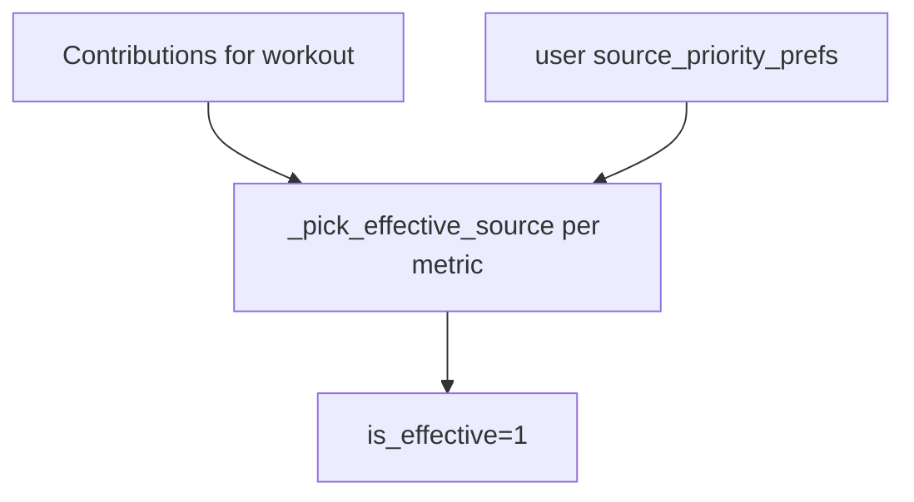

# Source Resolver — unified workout sources

Единая модель **источников данных** для кардио-тренировок: кто поставил HR, GPS, калории, длительность и как разрешаются конфликты.

Статус: **implemented** (migration v54).

См. также: [IMPORT_SYSTEM.md](./IMPORT_SYSTEM.md), [HEALTH_CONNECT.md](./HEALTH_CONNECT.md), [API.md](./API.md).

---

## Зачем

Одна тренировка может получить данные из нескольких каналов:

- FIT-файл с велокомпьютера
- Polar attach (HR + GPS)
- Health Connect с телефона/браслета
- Ручной ввод / legacy Excel

Resolver отвечает на вопросы:

- **Какой источник effective** для каждой метрики?
- **Можно ли HC перезаписать** существующую запись?
- **Есть ли конфликт** между источниками?
- **Связаны ли дубликаты** одной активности?

---

## Data model (v54)

| Таблица | Назначение |
|---------|------------|
| `workout_source_contributions` | Snapshot вклада source_type × metric на `cardio_workout_id` |
| `workout_source_links` | Связь canonical ↔ linked duplicate workouts |
| `user_profile.source_priority_prefs` | JSON: ordered source lists per metric |

Ключевые поля contribution:

- `metric` — `hr`, `gps`, `calories`, `duration`, `distance`, `sensors`, `metadata`
- `source_type` — `fit`, `polar`, `health_connect`, `manual`, `excel`, …
- `is_effective` — текущий победитель для metric
- `value_snapshot_json` — optional snapshot для debug/conflicts

---

## Source types

Определены в [`source_taxonomy.py`](../backend/services/source_taxonomy.py):

| Type | Typical origin |
|------|----------------|
| `fit` | FIT import (`fit_coospo`) |
| `polar` | Polar attach / AccessLink |
| `health_connect` | HC sync batch |
| `manual` | UI entry |
| `excel` | Legacy import (read-only enrichment) |

User-facing labels: `source_type_label()`.

---

## Registration hooks

Вызываются при ingest/attach:

| Event | Function |
|-------|----------|
| FIT import | `register_fit_import()` |
| Polar attach | `register_polar_attach()` |
| HC workout | `register_health_connect_workout()` |
| Manual | `register_contribution()` / manual paths |

Backfill CLI: `backend/scripts/backfill_workout_sources.py`.

---

## Fallback logic



1. Собрать все contributions для `cardio_workout_id` + metric
2. Применить user priority list (default из `default_priority_prefs()`)
3. Пометить winner `is_effective=1`
4. Вернуть `WorkoutSourceView` через API

---

## Conflict handling

`detect_conflicts()`:

- **Calories:** расхождение > **25 kcal** (`CALORIES_CONFLICT_THRESHOLD`) между effective sources
- UI: badges / diagnostics panel (developer tools)

Protected metadata sources (`PROTECTED_METADATA_SOURCES`) — FIT/Polar/manual не затираются HC metadata без явного правила.

---

## HC write protection

`should_block_hc_write(date, workout_type, ...)`:

- Если на эту дату+тип уже есть contribution от FIT, Polar, manual или Excel → **HC cardio skip**
- Предотвращает дубли и downgrade качества данных

Пример flow:

```
Polar bike ride imported → register_polar_attach
HC sync same evening → should_block_hc_write → SKIP
```

---

## Linked workouts

| Function | Purpose |
|----------|---------|
| `link_workouts(canonical_id, linked_id, reason)` | Explicit duplicate link |
| `is_linked_duplicate()` | Detect near-duplicate for UI |

Use case: две строки cardio от разных источников на одну реальную активность.

---

## User preferences API

| Метод | Путь |
|-------|------|
| GET | `/api/user/source-priorities` |
| PUT | `/api/user/source-priorities` |

Пример prefs (conceptual):

```json
{
  "hr": ["polar", "fit", "health_connect", "manual"],
  "calories": ["fit", "polar", "health_connect"]
}
```

---

## Workout sources API

| Метод | Путь |
|-------|------|
| GET | `/api/cardio/{workout_id}/sources` |

Response: `WorkoutSourceView` — effective source per metric + all contributions + conflicts.

---

## UI

| Surface | Component |
|---------|-----------|
| Workout detail | Source badges (effective source labels) |
| Developer Tools | `SourceResolverDiagnosticsPanel` — **experimental** |
| Settings | Priority prefs (if exposed in user settings) |

---

## Examples

### Polar preferred for HR

1. FIT import даёт GPS + device calories, weak HR
2. Polar attach добавляет chest strap HR
3. Prefs: `hr: [polar, fit, …]`
4. Effective HR = Polar; GPS может остаться FIT

### HC fallback for daily calories

- Workout-level: HC blocked if FIT exists
- Day-level: `daily_bracelet_calories` from HC still used in expenditure (partial analytics integration)

---

## Limitations

- Resolver v1 covers **cardio** contributions; strength HR uses separate mapping layer ([HR_ANALYTICS.md](./HR_ANALYTICS.md))
- No automatic merge of duplicate workouts without explicit link
- Conflict UI not in main workout flow (diagnostics only)

См. [CURRENT_LIMITATIONS.md](./CURRENT_LIMITATIONS.md).

---

## Tests

`backend/tests/test_source_resolver.py` — registration, priorities, HC block, conflicts.
